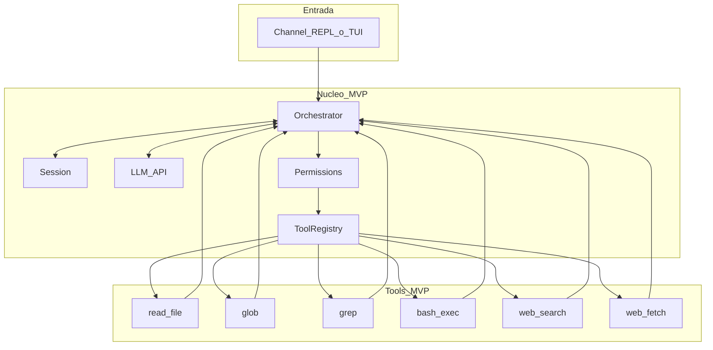
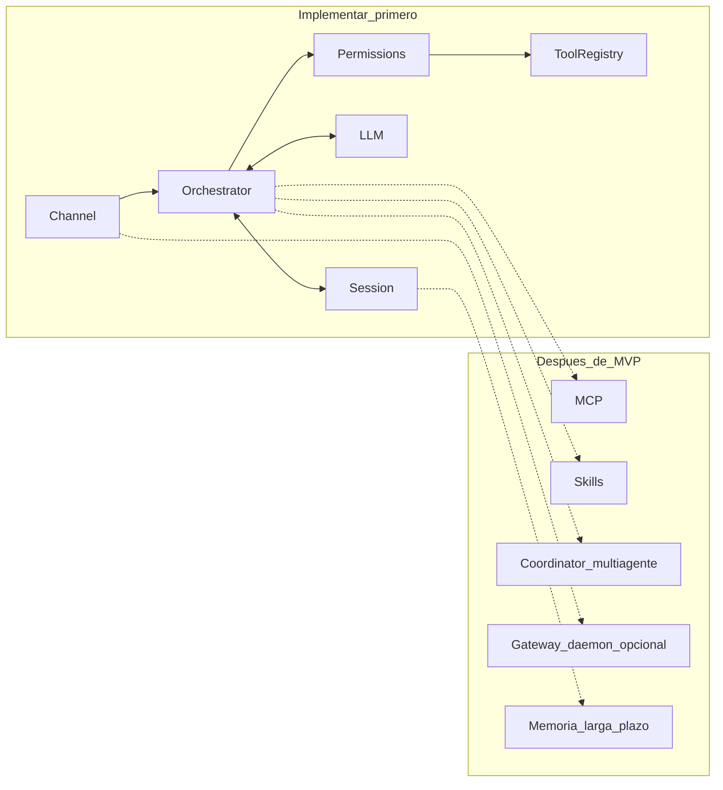

# Arquitectura del asistente personal (borrador para decisiones)

Este documento es el **lugar principal** para alinear conocimiento, opciones y decisiones antes de escribir implementación. No sustituye la documentación oficial de proveedores; sí recoge patrones útiles y **preguntas abiertas** que debemos resolver aquí.

**Stack de implementación (decidido)**

- El código del asistente irá en **Go** (binario único, concurrencia con goroutines, despliegue simple). Los tres `OPENCLAW_*.md` en la raíz resumen patrones del producto **OpenClaw** (upstream en GitHub), **sin** clon local en este workspace; [claw-code/](claw-code/) es otro subárbol vuestro. Nada de eso se **porta** literal: solo **criterios** de modularización y riesgo.

**Relación con otros archivos**

- **Mapa de cobertura ↔ índice [Claude Code Internals](https://claude-code-explain.helmcode.com/):** [DOCS_MAP.md](DOCS_MAP.md) — tabla por tema, alcance MVP y orden de lectura para implementar.
- **Hub conceptual (decisiones, fases, paquetes Go):** este [ARCHITECTURE.md](ARCHITECTURE.md).
- Lista de enlaces y fuentes externas: [References.MD](References.MD).
- **OpenClaw (referencia, sin carpeta local):** notas y enlaces upstream → [OPENCLAW_REFERENCE.md](OPENCLAW_REFERENCE.md); profundidad → [OPENCLAW_GATEWAY_CHANNELS.md](OPENCLAW_GATEWAY_CHANNELS.md), [OPENCLAW_AGENTS_AND_TOOLS.md](OPENCLAW_AGENTS_AND_TOOLS.md). **Código relacionado en local:** [claw-code/](claw-code/) (parity/TUI/Rust — no es OpenClaw).
- **Modelos locales (Ollama, límites de hardware, imagen/vídeo como herramientas):** [LOCAL_MODELS.md](LOCAL_MODELS.md).
- **Go vs Rust (asistente CLI):** [GO_VS_RUST_ASSISTANT.md](GO_VS_RUST_ASSISTANT.md).
- **Perfiles de agente (modelo + tools + permisos + contexto):** [AGENT_PROFILES.md](AGENT_PROFILES.md).
- **Memoria persistente (entre sesiones, índice + tipos):** [MEMORY_SYSTEM.md](MEMORY_SYSTEM.md).
- **Ventana de contexto y compactación (micro + auto, presupuestos):** [CONTEXT_COMPACTION.md](CONTEXT_COMPACTION.md).
- **Multi-agente: Coordinator Mode vs Team/Swarm (dos topologías):** [COORDINATOR_MODE.md](COORDINATOR_MODE.md).
- **Auto-modo / clasificador de seguridad (YOLO Classifier, consulta lateral LLM):** [YOLO_CLASSIFIER.md](YOLO_CLASSIFIER.md).
- **Hooks (eventos, extensión shell/HTTP/LLM, workspace trust):** [HOOKS.md](HOOKS.md).
- **Agentes personalizados (Markdown + frontmatter, tool Agent):** [CUSTOM_AGENTS.md](CUSTOM_AGENTS.md).
- **Plugins (manifiesto + skills/agents/hooks/MCP empaquetados, marketplace):** [PLUGINS.md](PLUGINS.md).
- **MCP (cliente hacia servidores externos, transportes, permisos):** [MCP.md](MCP.md).
- **Integración IDE (MCP localhost) vs Bridge remoto (referencia):** [IDE_BRIDGE.md](IDE_BRIDGE.md).
- **Tips prácticos del producto de referencia** (costes, límites de memoria, permisos, perfiles): [PRACTICAL_TIPS.md](PRACTICAL_TIPS.md).
- **Reintentos y backoff en llamadas al LLM** (429, 529, 5xx, por-invocation): [RETRY_LOGIC.md](RETRY_LOGIC.md).
- **Skills (SKILL.md, v3):** [SKILLS.md](SKILLS.md); **seguridad shell profunda:** [BASH_SECURITY.md](BASH_SECURITY.md); **costes API cloud:** [COSTS.md](COSTS.md).
- **Contrato herramientas MVP:** [TOOL_CONTRACT.md](TOOL_CONTRACT.md) — nombres, riesgos, límites, red, presupuesto de bucle.
- Este archivo: análisis, mapa conceptual y **decisiones pendientes** (marcadas como TBD).
- **Criterio transversal:** al iterar esta documentación con el asistente, **mantener coherencia** con el principio de **herramientas dedicadas** (§2.1): el shell es último recurso, no el sustituto de Read/Grep/Write. Los **perfiles de agente** (§2.7) combinan modelo + herramientas + permisos + qué contexto cargar; detalle en [AGENT_PROFILES.md](AGENT_PROFILES.md). **Multi-agente:** no mezclar Coordinator hub-and-spoke con Team/Swarm (§2.11). **Auto-modo:** sin clasificador lateral sólido, evitar combinar con permisos demasiado permisivos (**D5**, **D17**, [YOLO_CLASSIFIER.md](YOLO_CLASSIFIER.md)). **Hooks de proyecto:** tratar `.assistant/` / settings del repo como **no confiables** hasta workspace trust explícito (**D18**, [HOOKS.md](HOOKS.md) §8). **Agentes `.md` en el repo:** mismo criterio — definen tools/MCP/hooks y son **código de configuración ejecutable** vía shell hooks (**D19**, [CUSTOM_AGENTS.md](CUSTOM_AGENTS.md) §1). **Plugins de marketplace:** riesgo **supply chain**; allowlist/denylist y validación de manifiesto (**D20**, [PLUGINS.md](PLUGINS.md) §1). **IDE local:** la integración **MCP localhost** con el editor es **distinta** del **Bridge** remoto a una UI web; planificarlas por separado (**D21**, [IDE_BRIDGE.md](IDE_BRIDGE.md)). **MCP §2.8 vs IDE §2.15:** [MCP.md](MCP.md) describe el cliente hacia **servidores de integración** (stdio/URL); [IDE_BRIDGE.md](IDE_BRIDGE.md) el enlace al **editor** — mismo protocolo en muchos casos, **distinto ecosistema de pares**. **Reintentos API** (**D22**, [RETRY_LOGIC.md](RETRY_LOGIC.md)): backoff **por invocación** a `llm`; no confundir con reintentos de `web_fetch` ni con bucles del orquestador.

---

## 1. Objetivo del producto (alcance funcional)

Queremos un asistente tipo “agentic CLI” inspirado en ideas de **Claude Code**, no en copiar un producto cerrado:

- **Chat** con el usuario en terminal (o capa equivalente).
- **Principio de producto explícito:** el modelo debe **preferir herramientas dedicadas** frente a abusar del shell para tareas que ya tienen herramienta (lectura, búsqueda en repo, edición, web); ver §2.1 y **D12**.
- **Búsqueda en internet** (resultados acotados y trazables).
- **Ejecución de comandos** en el sistema, con política de permisos explícita.
- Extensibilidad razonable (herramientas, MCP, skills) como **fases posteriores**, definidas aquí pero no obligatorias en un primer entregable conceptual.
- **Integración con el editor (local):** el usuario debe poder enlazar el asistente con **VS Code / Cursor / Windsurf** (y, en horizonte, JetBrains) mediante **MCP sobre localhost** — descubrimiento vía lockfiles, sincronización de ediciones y contexto; ver [IDE_BRIDGE.md](IDE_BRIDGE.md) y **D21**. No exige paridad con una extensión concreta de terceros: sí un **contrato documentado** y un camino de referencia.
- **Objetivo de despliegue frecuente:** poder usar **modelos locales** en la propia máquina (p. ej. vía **Ollama**) además de, o en lugar de, APIs remotas; el diseño modular (§3–§4) ya lo permite sustituyendo la implementación de `internal/llm`. Detalle y checklist: [LOCAL_MODELS.md](LOCAL_MODELS.md).

**Fuera de alcance hasta decidir explícitamente**: paridad 1:1 con Claude Code, **Bridge remoto** análogo a claude.ai (OAuth + backend del proveedor; ver [IDE_BRIDGE.md §3](IDE_BRIDGE.md)), telemetría avanzada, sandbox OS en todas las plataformas.

**Dentro del alcance de producto (no del MVP mínimo de código):** **integración IDE local** — CLI y editor en la misma máquina, MCP localhost; priorizada en roadmap **v1+** (**D21**).

---

## 2. Conocimiento consolidado (qué hace “bien” un sistema como el de referencia)

### 2.1 Herramientas como unidad principal y regla “dedicated tools”

Este apartado es **deliberadamente visible**: resume la práctica descrita en productos de referencia (p. ej. [Claude Code internals — Tools](https://claude-code-explain.helmcode.com/tools)): muchas herramientas integradas y un **system prompt** que obliga al modelo a usarlas antes que el shell genérico.

**Por qué importa**

- Las llamadas de herramienta quedan **nombradas, revisables y auditables** frente a un `bash` opaco (`cat`, `grep`, redirecciones).
- Los permisos y la política de riesgo pueden aplicarse **por herramienta** (lectura vs red vs shell).
- Reduce sorpresas de tokenización y diferencias entre sistemas (Windows vs Unix) si las operaciones pasan por APIs controladas.

**Regla de oro (equivalente a “don’t use Bash for what has a tool”)**

- **Shell / Bash:** solo para operaciones que **no** tengan herramienta dedicada o que sean intrínsecamente genéricas (cadena corta de sistema).
- Si el modelo intenta `bash` para leer un archivo o buscar en el repo, el sistema (prompt + recordatorios + tests de comportamiento) debe empujar a **Read / Grep / Glob**.

**Sustituciones típicas** (tabla guía; nombres exactos se fijarán en el contrato de herramientas)

| En lugar de (vía shell)                            | Usar herramienta dedicada             |
| -------------------------------------------------- | ------------------------------------- |
| `cat`, `head`, `tail`, lectura con `sed` one-liner | **Read**                              |
| Edición con `sed -i`, `awk` que muta               | **Edit** (o **Write** si es creación) |
| `echo` + redirección, heredoc                      | **Write**                             |
| `find`, `ls` para inventario                       | **Glob**                              |
| `grep`, `rg` sobre el workspace                    | **Grep**                              |

**Taxonomía de referencia (9 categorías, ~45 herramientas en el producto de referencia)**  
No es obligatorio implementar todas; sirve para **ordenar el roadmap** y saber qué es “MVP” vs “paridad”.

| Categoría  | Herramientas de referencia (nombres orientativos)        | Prioridad sugerida **nosotros**                                                                                                                    |
| ---------- | -------------------------------------------------------- | -------------------------------------------------------------------------------------------------------------------------------------------------- |
| Files      | Read, Write, Edit, Glob, Grep, NotebookEdit              | **goclaw (actual):** **Read**, **write_file**, **edit_file**, **Glob**, **Grep**; Notebook opcional / tardío                                                                                |
| Shell      | Bash, PowerShell, REPL                                   | MVP: **Bash** (o `exec`) con política estricta; PowerShell si Windows es primera clase                                                             |
| Web        | WebFetch, WebSearch                                      | MVP: ambas (ya en §3)                                                                                                                              |
| Agents     | Agent, SendMessage, TeamCreate, TeamDelete, Task\*, …    | Post-MVP: **§2.11** distingue **Coordinator** (solo orquestación) vs **Team/Swarm** (peer + mailboxes); [COORDINATOR_MODE.md](COORDINATOR_MODE.md) |
| Planning   | EnterPlanMode, ExitPlanMode, EnterWorktree, ExitWorktree | Post-MVP / alineado con flujo “plan”                                                                                                               |
| Tasks      | TaskCreate, TaskUpdate, TaskStop, TaskOutput, TodoWrite  | Post-MVP (gestión de tareas en sesión)                                                                                                             |
| Scheduling | CronCreate, CronDelete, CronList, RemoteTrigger          | Post-MVP + feature flag                                                                                                                            |
| UI         | AskUserQuestion, Brief, SkillTool                        | v1–v2 (preguntas al usuario, skills)                                                                                                               |
| MCP        | MCPTool, ListMcpResources, ReadMcpResource, McpAuth      | **v2+** según **D6** — expectativa de mercado: agentes “serios” integran MCP antes que skills/plugins ([MCP.md](MCP.md) §8)                        |

**Herramientas condicionales (feature flags)**  
En el producto de referencia existen tools solo con flags (p. ej. Sleep vía KAIROS, cron vía `AGENT_TRIGGERS`, navegador vía `WEB_BROWSER_TOOL`). **Eco diseño:** registrar en código las herramientas pero **no exponerlas al modelo** hasta activar flag o config; evita superficie de ataque y ruido en el contexto.

**Nota sobre modelos locales:** cuanto menor sea el modelo, **más** ayuda una lista corta de herramientas bien nombradas y la regla explícita en el prompt; abusar de Bash suele empeorar la tasa de éxito (ver [LOCAL_MODELS.md](LOCAL_MODELS.md) D2).

### 2.2 Motor de conversación + bucle de herramientas

- Un **orquestador** envía mensajes al modelo, recibe texto o `tool_use`, ejecuta herramientas y vuelve al modelo con `tool_result` hasta una respuesta final.
- En productos maduros, el código que llama al modelo concentra **reintentos con backoff**, límites de contexto y streaming; conviene concentrarlo en **`internal/llm`** (política por código HTTP, presupuesto **por llamada**, no global — [RETRY_LOGIC.md](RETRY_LOGIC.md)).

### 2.3 Permisos por modos (no un solo “on/off”)

- Modos típicos: interactivo (pedir confirmación), **auto** (aprobar sin preguntar salvo bloqueos), solo lectura, bloquear sin preguntar, o modos de máximo riesgo (aprobar todo — **desaconsejado** sin otras defensas).
- En productos maduros, el modo **auto** no confía solo en el modelo del bucle principal: incorpora un **monitor de seguridad** que hace una **llamada lateral** al LLM con transcript filtrado y protocolo explícito **allow/deny** (en Claude Code: “**YOLO Classifier**”). Eso reduce tragedias (deploy no pedido, destrucción irreversible, exfiltración, debilitar TLS, etc.). Detalle: [YOLO_CLASSIFIER.md](YOLO_CLASSIFIER.md). Referencia tercera: [YOLO Classifier — claude-code-explain](https://claude-code-explain.helmcode.com/yolo-classifier).
- **Roadmap nuestro:** MVP con **D5** conservador y sin API lateral; **v1** fast paths **locales** + patrones peligrosos + interfaz `ToClassifierInput` por tool; **v2+** clasificador **dos etapas** + contadores de denegación + _fail closed_ si **D17** lo aprueba.

### 2.4 Seguridad del shell (defensa en profundidad)

- Capas independientes: validación de comando, **permisos** (§2.3), rutas, archivos sensibles, opcionalmente **sandbox**, y —en auto-modo— **clasificador / patrones** ([YOLO_CLASSIFIER.md](YOLO_CLASSIFIER.md)); en muchos entornos Windows la sandbox OS es la capa más difícil; conviene documentar supuestos.
- Ideas prácticas para decidir: allowlist inicial, límites de metacaracteres, división de comandos compuestos con techo de subcomandos, timeouts, entorno depurado para subprocess.
- Profundidad y capas tipo producto maduro: [BASH_SECURITY.md](BASH_SECURITY.md) (**D4**).

### 2.5 Contexto largo: compactación

El producto de referencia **gestiona activamente** la ventana (no solo “falla cuando se llena”). Patrón analizado en terceros: [Context & Compaction — claude-code-explain](https://claude-code-explain.helmcode.com/context-compaction). Profundidad y eco Go: [CONTEXT_COMPACTION.md](CONTEXT_COMPACTION.md).

**Dos mecanismos complementarios**

| Mecanismo                      | Qué hace                                                                                                                                                                             | En referencia (orden de magnitud)                                                                                                        |
| ------------------------------ | ------------------------------------------------------------------------------------------------------------------------------------------------------------------------------------ | ---------------------------------------------------------------------------------------------------------------------------------------- |
| **Micro-compactación**         | Sustituye **en línea** resultados antiguos de herramientas por un marcador corto; reduce ruido sin resumir todo el chat.                                                             | Afecta tools tipo Read, Grep, Glob, Bash, WebSearch, WebFetch, Edit, Write; imágenes con estimación fija conservadora (~2K tokens c/u).  |
| **Auto-compactación (fuerte)** | Al quedar poco espacio libre, un **sub-agente** resume el historial y el hilo visible se **reemplaza** por ese resumen; luego hay presupuesto para **releer** pocos ficheros/skills. | Disparo ~**13K** tokens restantes; post-compact ~**50K** con tope de archivos/tokens por archivo; **3 fallos** seguidos ⇒ cortacircuito. |

**Ventana / overrides (referencia):** ~200K por defecto; modos ~1M en ciertas familias de modelo; override vía config tipo `MAX_CONTEXT_TOKENS`. **Nosotros:** el techo real depende de API u Ollama (véase [LOCAL_MODELS.md](LOCAL_MODELS.md)); conviene umbrales **proporcionales** o por tabla de proveedor (**D15**).

**Salida del modelo por fase (referencia):** máximos distintos para turno normal, turno con slots reservados, recuperación tras error y **salida del agente de compactación** (~20K para el resumen) — detalle en [CONTEXT_COMPACTION.md §5](CONTEXT_COMPACTION.md).

**Manual:** comando tipo `/compact` **antes** del límite suele dar resúmenes más claros que un auto-compact de último minuto; equivalente REPL/flag en nuestro producto cuando exista compactación fuerte.

**Relación con memoria (§2.10):** la compactación recorta el **hilo**; [MEMORY_SYSTEM.md](MEMORY_SYSTEM.md) conserva hechos **estables** fuera del transcript.

### 2.6 Prompt del sistema por capas

- Capas comunes: prompt por defecto, instrucciones de agente/sub-agente, anexos dinámicos (**índice de memoria** `MEMORY.md` cuando exista — §2.10, herramientas MCP, CWD, idioma).
- La separación “estático vs dinámico” afecta **caché y coste** si el proveedor lo soporta; es una decisión TBD según el API elegido.
- Referencia terceros (profundidad): [System Prompt — claude-code-explain](https://claude-code-explain.helmcode.com/system-prompt). Índice local ↔ explainer: [DOCS_MAP.md](DOCS_MAP.md) fila 01.

### 2.7 Perfiles de agente (tipo “Agent System”) y multi-agente

Este bloque es **tan importante** como §2.1: en productos maduros cada “agente” no es un modelo suelto, sino un **perfil** con **modelo**, **subconjunto de herramientas**, **modo de permisos** y **qué contexto se inyecta** (reglas del repo, `git status`, etc.). Referencia analizada en terceros: [Agents — claude-code-explain](https://claude-code-explain.helmcode.com/agents). Tabla completa de los 6 tipos de ejemplo y eco Go: [AGENT_PROFILES.md](AGENT_PROFILES.md). Esos tipos son **built-in**; encima conviven **definiciones en Markdown** (un fichero = un agente) — §2.13 y [CUSTOM_AGENTS.md](CUSTOM_AGENTS.md).

**Por qué importa**

- **Menos superficie de error:** un explorador de código no recibe `Write` ni `Agent`; no puede reventar el árbol ni spawning recursivo por accidente.
- **Coste:** perfiles “ligeros” omiten archivos de reglas masivos o `git status` si la tarea no lo necesita (en referencia, Explore/Plan ahorran tokens enormes omitiendo `CLAUDE.md`).
- **Coste de modelo:** tareas acotadas pueden usar un modelo más barato o más pequeño (Guide, Explore externo).

**Resumen de los 6 tipos de referencia** (nombres propios del producto analizado; nosotros podemos renombrar)

| Tipo              | Rol en una frase                                                |
| ----------------- | --------------------------------------------------------------- |
| General-Purpose   | Todo el toolbox; hereda modelo del padre                        |
| Explore           | Solo lectura en repo; sin sub-agentes; ideal búsquedas          |
| Plan              | Solo lectura + diseño; entrega 3–5 archivos críticos            |
| Verification      | Comprobaciones tras cambios; resultado `VERDICT: …`; background |
| Guide (docs)      | Pocas tools + web; permisos `dontAsk`; modelo barato            |
| Status Line Setup | Solo Read+Edit; una función de producto concreta                |

**Patrones de orquestación** (complementarios a los perfiles)

- **Coordinator hub-and-spoke** y **Team/Swarm peer-to-peer** son **dos diseños distintos** (activación, tools del “centro”, mensajería, UI). Resumen canónico: **§2.11** y [COORDINATOR_MODE.md](COORDINATOR_MODE.md). No confundir “modo coordinador” (coordinador **sin** lectura/escritura en disco) con un team lead que lleva toolbox completo.

**Roadmap sugerido en nuestro proyecto**

| Fase | Perfiles                                                                                                    |
| ---- | ----------------------------------------------------------------------------------------------------------- |
| MVP  | Un solo perfil tipo **General-Purpose** (equivalente a sesión interactiva actual)                           |
| v1   | **Explore** + **Plan** (filtro de tools + política de contexto sin `AGENTS.md`/`git` pesado cuando proceda) |
| v2+  | **Verification** (background); **Guide** / special-purpose solo si aportan producto claro                   |

**Implementación Go (orientativa)** ver §4.1 (`coordinator` / `swarm`, perfiles) y [AGENT_PROFILES.md §4](AGENT_PROFILES.md).

### 2.8 MCP (Model Context Protocol)

Patrón analizado en terceros: [MCP — claude-code-explain](https://claude-code-explain.helmcode.com/mcp). Detalle: [MCP.md](MCP.md).

**Por qué es central hoy:** los asistentes comerciales y open source que compiten en **extensibilidad** exponen casi siempre un **cliente MCP** además de herramientas builtin: integraciones GitHub, bases de datos, navegadores, ticketing, etc., sin recompilar el núcleo.

**Qué implica técnicamente:** servidores MCP (subprocess **stdio** o remotos **SSE** / **HTTP** streamable / **WebSocket**); namespaced tools como `mcp__<server>__<tool>` para permisos; descubrimiento de tools/resources/prompts; timeouts; límites de salida (a menudo spill a fichero temporal); **OAuth / pseudo-tool de auth** en escenarios remotos; **varios scopes de config** (usuario, proyecto, plugin, enterprise) con orden de fusión.

**Eco Go:** paquete `internal/mcp` ([MCP.md](MCP.md) §8); mismo pipeline `permissions` que `internal/tools`; [MCP Go SDK](https://github.com/modelcontextprotocol/go-sdk) como base plausible.

**Roadmap:** **MVP puede prescindir** de MCP para validar bucle + tools builtin; **v2 recomendado** para producto competitivo (stdio + registro + políticas); **v3+** transportes remotos completos y paridad avanzada según **D6**.

### 2.9 Skills (prompts reutilizables)

- Archivos Markdown con **frontmatter** (nombre, cuándo usar, herramientas permitidas, etc.) que inyectan instrucciones o flujos; invocación tipo `/comando`.
- En el producto analizado el frontmatter puede declarar **hooks en sesión** (`PostToolUse`, etc.); mismo sistema de eventos que §2.12 — [HOOKS.md §1](HOOKS.md).
- Encaja como capa de producto **después** del MVP de chat + web + shell establecido.
- Contrato resumido: [SKILLS.md](SKILLS.md).

### 2.10 Memoria persistente (entre sesiones)

**Sí aporta** al producto, pero **después del MVP**: complementa a `session` (§2.5), que solo vive en la conversación actual. Patrón analizado en terceros: [Memory — claude-code-explain](https://claude-code-explain.helmcode.com/memory). Detalle: [MEMORY_SYSTEM.md](MEMORY_SYSTEM.md).

**Idea clave**

- Ficheros Markdown bajo un directorio de **memoria por proyecto** + un índice **`MEMORY.md`** que se inyecta **siempre** en la capa dinámica del prompt (§2.6).
- **Cuatro tipos** orientativos: `user`, `feedback`, `project`, `reference` — cada uno con criterios de “qué merece guardarse”.
- **Límites duros** en el índice (en referencia ~**200 líneas** / ~**25 KB**); si se superan, el contenido deja de entrar en contexto (truncado); conviene diseñar avisos o resúmenes manuales (ver doc de profundidad).

**Qué no es memoria**

- Convenciones del repo → `AGENTS.md` / documentación en git.
- Hechos deducibles del código o de git → no duplicar en memoria (lista explícita en [MEMORY_SYSTEM.md §5](MEMORY_SYSTEM.md)).

**Extracción automática (v2+)**  
Sub-agente o tarea en background tras turnos “silenciosos”, permisos **restringidos** a escribir solo en el árbol de memoria; tope de turnos del extractor; deduplicación — ver [MEMORY_SYSTEM.md §6](MEMORY_SYSTEM.md).

**Roadmap**

| Fase  | Memoria                                                                          |
| ----- | -------------------------------------------------------------------------------- |
| MVP   | Opcional: **ninguna** persistencia; solo `session`                               |
| v1–v2 | Memoria **manual** o herramientas explícitas `memory_write` / lectura del índice |
| v3+   | **Extracción automática** + políticas de dedup                                   |

### 2.11 Multi-agente: Coordinator Mode y Team/Swarm (esencial)

En el producto de referencia conviven **dos sistemas multi-agente**, no variantes menores del mismo:

| Modo                 | Idea en una frase                                                                                                                                                                                        |
| -------------------- | -------------------------------------------------------------------------------------------------------------------------------------------------------------------------------------------------------- |
| **Coordinator Mode** | **Hub-and-spoke:** el centro solo **orquesta** (tools típicas: Agent, SendMessage, TaskStop, SyntheticOutput); **sin** Read/Write/Bash directos; workers llevan el toolbox completo y sesiones aisladas. |
| **Team / Swarm**     | **Peer-to-peer:** compañeros se mensajean (SendMessage entre nombres o broadcast); team lead distinto; buzones **en fichero** + JSON; UI opcional **tmux** / iTerm2.                                     |

**Invariante de producto (referencia):** los workers **no** ven el chat del coordinador con el usuario; toda delegación debe ser **autocontenida** (rutas, líneas, instrucciones explícitas).

**Activación (referencia):** Coordinator → flag de build + env `CLAUDE_CODE_COORDINATOR_MODE=1`; Team/Swarm → tool Agent con **`team_name`**. Fases (research → synthesis → implementation → verification), continue vs spawn, XML `task-notification`, mailboxes y routing: [COORDINATOR_MODE.md](COORDINATOR_MODE.md). Terceros: [Coordinator Mode — claude-code-explain](https://claude-code-explain.helmcode.com/coordinator-mode).

**Roadmap nuestro:** MVP sin esto; **v2** puede introducir Coordinator **mínimo** (sin tmux); **v3+** Team/Swarm y mailboxes — §4.4 y **D16**.

### 2.12 Hooks (automatización por eventos)

Patrón analizado en terceros: [Hooks — claude-code-explain](https://claude-code-explain.helmcode.com/hooks). Detalle: [HOOKS.md](HOOKS.md).

**Qué son:** acciones (`command`, `prompt`, `agent`, `http`) enlazadas a **eventos** del ciclo de vida (~27 en referencia: `PreToolUse`, `PostToolUse`, `SessionStart`, `PermissionRequest`, `PreCompact`, `SubagentStop`, …). Reciben JSON por **stdin**; responden por **stdout** (JSON o texto); **exit 2** puede **bloquear** la operación y enviar **stderr** al modelo o al usuario.

**Por qué encaja aquí:** capa **ortogonal** a herramientas y al LLM principal — formateo tras `Write`, bloqueo de `git` peligroso, auto-aprobación en CI en `PermissionRequest`, notificación tras `Stop`, watchers `FileChanged`, integración con compactación y skills.

**Fuentes (prioridad):** policy administrada → usuario → proyecto → local → plugins → sesión en RAM → hooks programáticos. **Riesgo:** hooks `command` = código del usuario sin sandbox; un repo puede registrar hooks maliciosos → **workspace trust** y flags tipo _solo hooks administrados_ (**D18**).

**Eco Go:** paquete `internal/hooks`; orquestador emite eventos; `permissions` fusiona salida con precedencia documentada; roadmap §4.4.

### 2.13 Agentes personalizados (Markdown + frontmatter)

Patrón analizado en terceros: [Custom Agents — claude-code-explain](https://claude-code-explain.helmcode.com/custom-agents). Detalle: [CUSTOM_AGENTS.md](CUSTOM_AGENTS.md).

**Qué aporta:** extensión **declarativa** sin recompilar — drop-in de `*.md` con YAML (`name`, `description`, `tools`, `disallowedTools`, `model`, `permissionMode`, `memory`, `mcpServers`, `hooks`, `skills`, `maxTurns`, `color`, `isolation`…); el cuerpo del Markdown es el **system prompt**. La tool **Agent** / `subagent_type` **resuelve** built-in vs custom por **prioridad** (proyecto > usuario > plugin > built-in en referencia).

**Por qué es interesante implementarlo:** misma abstracción que [AGENT_PROFILES.md](AGENT_PROFILES.md) pero **versionable en repo** y editable por equipos; **description** guía la selección del modelo (“use when…”); encaja con [COORDINATOR_MODE.md](COORDINATOR_MODE.md) (workers especializados), [HOOKS.md](HOOKS.md) (hooks por agente, lifecycle acotado), memoria **por agente** (scopes `user` / `project` / `local` — distintos de §2.10, ver CUSTOM_AGENTS §5).

**Riesgo:** agente de proyecto + hooks/MCP = superficie alta; alinear con **workspace trust** y restricciones tipo **plugin** (CUSTOM_AGENTS §7). Variable tipo “modo simple sin customs” en referencia.

**Roadmap nuestro:** §4.4 — built-ins primero; **v3+** descubrimiento de `.md` y merge de prioridades (**D19**).

### 2.14 Plugins (paquetes modulares)

Patrón analizado en terceros: [Plugins — claude-code-explain](https://claude-code-explain.helmcode.com/plugins). Detalle: [PLUGINS.md](PLUGINS.md).

**Qué aporta:** un **solo paquete instalable** puede combinar comandos `/`, skills, agentes `.md`, estilos de salida, hooks, servidores MCP/LSP, canales y overrides de settings — con **`userConfig`** (opciones al habilitar) y variables para plantillas. Encaja como **capa de distribución** encima de [CUSTOM_AGENTS.md](CUSTOM_AGENTS.md), [HOOKS.md](HOOKS.md), §2.8 MCP y §2.9 skills sin duplicar el modelo mental de cada uno.

**Cabida:** `internal/plugin` (o composición desde `config`) **mergea** contribuciones al arranque; políticas `allowedPlugins` / `deniedPlugins` / `strictPluginOnlyCustomization`; prefijo MCP `plugin:…` con deduplicación (manual vs plugin). **Riesgo:** dependencias entre plugins, marketplaces no confiables — **D20**.

**Roadmap:** §4.4 — carga local / `--plugin-dir` en **v3+** si D20; marketplace remoto y actualizaciones **v4+** opcional.

### 2.15 IDE (local) y Bridge (remoto)

Patrón analizado en terceros: [Bridge & IDE — claude-code-explain](https://claude-code-explain.helmcode.com/bridge-ide). Detalle: [IDE_BRIDGE.md](IDE_BRIDGE.md).

**Dos sistemas:** (1) **Integración IDE** — el CLI se conecta como **cliente MCP** al servidor que levanta la extensión en **localhost** (SSE / WebSocket), con **descubrimiento** por lockfiles en disco; **contexto** desde el editor; **diffs** y aceptar/rechazar cambios enlazados al flujo de edición. (2) **Bridge** — túnel **remoto** hacia una UI web y backend del proveedor; OAuth, JWT, SSE/WSS, `can_use_tool` hacia el navegador; **no** es el mismo problema que (1).

**Cabida:** paquete `internal/ide` (descubrimiento + cliente MCP hacia el editor); interfaces inyectadas en el orquestador para notificar herramientas `Write`/`Edit` y, si aplica, leer “contexto IDE”. **Riesgo:** localhost sigue siendo superficie de ataque entre procesos; tokens en WS y binds acotados (**D21**).

**Roadmap:** **v1+** integración IDE tras establecer contrato de herramientas y permisos; Bridge estilo producto web — solo referencia o reimplementación **propia** muy posterior.

### 2.16 Tips prácticos (comportamiento observable)

Patrón recogido en terceros: [Practical Tips — claude-code-explain](https://claude-code-explain.helmcode.com/tips). Detalle: [PRACTICAL_TIPS.md](PRACTICAL_TIPS.md).

**Qué son:** decisiones de implementación que se **notan** al usar el producto — prioridad de `CLAUDE.md` (nosotros: `AGENTS.md` / `CLAUDE.md`), memoria persistente, **Explore** con modelo barato, **peligro** de `bypassPermissions`, **compact** ~13K restantes, `/fast` como **recargo** sin cambio de modelo, truncado de `MEMORY.md`, agentes `.md`, bloqueos del clasificador en auto-modo, agente **Verification**.

**Para qué sirve este doc:** checklist rápido al **diseñar** el propio CLI (qué documentar al usuario, qué flags exponer, qué límites fijar). No sustituye [MEMORY_SYSTEM.md](MEMORY_SYSTEM.md), [CONTEXT_COMPACTION.md](CONTEXT_COMPACTION.md), [YOLO_CLASSIFIER.md](YOLO_CLASSIFIER.md), [AGENT_PROFILES.md](AGENT_PROFILES.md).

### 2.17 Reintentos y backoff (API del modelo)

Patrón analizado en terceros: [Retry Logic — claude-code-explain](https://claude-code-explain.helmcode.com/retry-logic). Detalle: [RETRY_LOGIC.md](RETRY_LOGIC.md).

**Qué resuelve:** **429** / **529** / **5xx** y timeouts con **backoff exponencial** (orden 500 ms → techo minutos), presupuesto típico **~10** intentos **por invocación** al LLM; **429** con `Retry-After` cuando exista; **529** con presupuesto menor en foreground en referencia.

**Qué no es:** no sustituye **iron gate** del clasificador ni errores **4xx** de cliente (auth); las llamadas **laterales** (YOLO, compactación) deben tener la misma disciplina pero **no bloquear** con reintentos infinitos ([YOLO_CLASSIFIER.md](YOLO_CLASSIFIER.md) §9).

**Eco Go:** `internal/llm` (+ **D22**); observabilidad en §4.5; modo “unattended” largo solo si se diseña explícitamente.

### 2.18 Temas del explainer sin doc de profundidad dedicada (o fuera de MVP)

Referencia índice: [claude-code-explain.helmcode.com](https://claude-code-explain.helmcode.com/). Mapa 1:1: [DOCS_MAP.md](DOCS_MAP.md).

| Tema (helmcode)                                                                                                     | En nuestro repo                                              | Alcance MVP                                                                                       |
| ------------------------------------------------------------------------------------------------------------------- | ------------------------------------------------------------ | ------------------------------------------------------------------------------------------------- |
| **System prompt** (6 capas, caché)                                                                                  | §2.6 + [DOCS_MAP.md](DOCS_MAP.md)                            | sí: capas mínimas en `internal/prompt`; sin paridad 6 capas el día uno                            |
| **Proactive / KAIROS** ([proactive-mode](https://claude-code-explain.helmcode.com/proactive-mode))                  | Solo esta tabla                                              | **no** — tareas autónomas por ticks; fase no planificada                                          |
| **Hidden features** ([hidden-features](https://claude-code-explain.helmcode.com/hidden-features))                   | —                                                            | **no** — flags internos del producto analizado; si hacemos flags propios, documentarlos en config |
| **Slash commands** (~100 en referencia) ([slash-commands](https://claude-code-explain.helmcode.com/slash-commands)) | [PLUGINS.md](PLUGINS.md) (patrón `commands/`); §2.14         | **deferred** — MVP REPL; v3+ plugins/comandos                                                     |
| **Permissions** (6 modos, tabla completa)                                                                           | §2.3 + [YOLO_CLASSIFIER.md](YOLO_CLASSIFIER.md)              | sí comportamiento; **D5** / **D17** fijan modos                                                   |
| **Tools** (45+ en referencia)                                                                                       | §2.1                                                         | sí subset MVP en §4.4                                                                             |
| **Bash security** (22+ validadores)                                                                                 | §2.4 + [BASH_SECURITY.md](BASH_SECURITY.md)                  | sí política mínima; paridad validadores **no** MVP                                                |
| **Costs** / **fast**                                                                                                | [COSTS.md](COSTS.md), [PRACTICAL_TIPS.md](PRACTICAL_TIPS.md) | **N/A** local; sí si D1 cloud                                                                     |

**Para IA:** si no aparece en la tabla como **sí** o **deferred** en MVP, **no** asumir que está en el primer binario sin leer §4.4 y [DOCS_MAP.md](DOCS_MAP.md).

---

## 2 bis. OpenClaw como espejo conceptual (upstream, no stack local)

El producto **OpenClaw** ([GitHub openclaw/openclaw](https://github.com/openclaw/openclaw), **Node / TypeScript**, monorepo pnpm) resuelve un problema **más amplio** (gateway multi-canal, daemon, UI web, extensiones npm). **En este workspace no lo tenéis clonado**; usad los tres `OPENCLAW_*.md` + el repo público si necesitáis mirar rutas. Para el asistente en **Go** nos interesa sobre todo:

| Necesidad en Go                                                       | Dónde mirar (ideas OpenClaw upstream)                          | Documento de profundidad                                                                                                        |
| --------------------------------------------------------------------- | -------------------------------------------------------------- | ------------------------------------------------------------------------------------------------------------------------------- |
| Árbol del monorepo y qué ignorar en v1                                | [OPENCLAW_REFERENCE.md](OPENCLAW_REFERENCE.md)                 | Mapa + tabla `src/`                                                                                                             |
| Gateway, daemon, canales, routing                                     | `src/gateway/`, `src/channels/`, `src/daemon/`, `src/routing/` | [OPENCLAW_GATEWAY_CHANNELS.md](OPENCLAW_GATEWAY_CHANNELS.md)                                                                    |
| Herramientas web (SSRF, fetch), agente, auto-respuesta, contexto, MCP | `src/agents/tools/`, `auto-reply/`, `context-engine/`, `mcp/`  | [OPENCLAW_AGENTS_AND_TOOLS.md](OPENCLAW_AGENTS_AND_TOOLS.md)                                                                    |
| Hooks de ciclo de vida (eventos, skills bundled)                      | `src/hooks/`                                                   | [OPENCLAW_AGENTS_AND_TOOLS.md §8](OPENCLAW_AGENTS_AND_TOOLS.md) + [HOOKS.md](HOOKS.md)                                          |
| Extensiones empaquetadas (skills npm / ClawHub, plugins)              | `extensions/`, `skills/`, docs de producto                     | [PLUGINS.md](PLUGINS.md) (patrón CC); OpenClaw **ClawHub** en práctica                                                          |
| IDE / gateway (MCP, bridge protocol docs)                             | `docs/gateway/`, protocolo bridge en docs                      | [IDE_BRIDGE.md](IDE_BRIDGE.md): nosotros priorizamos **MCP localhost** hacia el editor; OpenClaw puede documentar bridge aparte |

**Repo local distinto:** [claw-code/](claw-code/) (parity, philosophy, Rust/TUI) — ver Tier 2 en §8.0; no sustituye navegar OpenClaw en GitHub si buscáis la tubería gateway/agente.

Regla práctica: si una discusión de diseño se alarga, **mover el detalle** al .md de profundidad correspondiente y dejar aquí solo el acuerdo o la decisión (una frase + enlace).

---

## 2 ter. Modelos locales: encaje arquitectónico (sin cambiar el stack Go)

Resumen de una estrategia **realista** alineada con lo que suele usarse en 2025–2026 en equipos con **GPU media y 32 GB RAM** (p. ej. RTX 4050). El análisis completo, checklist y mapeo “goclaw → paquetes” están en [LOCAL_MODELS.md](LOCAL_MODELS.md).

**Qué encaja tal cual**

- El bloque **LLM** del §3 es un **cliente HTTP**: da igual que el servidor sea Anthropic en la nube o **Ollama** en `127.0.0.1`. El orquestador y las herramientas no cambian de forma de trabajo.
- **Modelos pequeños/medianos** (orden 7B–14B coder, p. ej. familia Qwen2.5-Coder) son el objetivo sensato para iterar rápido y no saturar VRAM.
- **Herramientas simples y estables** (lectura, shell acotado, web con políticas) compensan la menor “fuerza bruta” del modelo frente a un cloud flagship.

**Qué no copiamos del típico stack Python (adaptación)**

- Un CLI en **Typer / Rich / Prompt Toolkit** no es nuestro ejecutable: la interfaz sigue en **Go** (D8 elige REPL mínimo vs TUI con librería Go).
- **Imagen y vídeo** (AUTOMATIC1111, AnimateDiff, etc.) no sustituyen al LLM: son **herramientas opcionales** en `internal/tools`, con permisos, timeouts y cuidado de **contención de GPU** con Ollama.

**Imperativo de diseño con modelos locales**

- Cerrar **D2** con pruebas reales: muchos modelos locales **fluctúan** en tool-calling estructurado; hace falta **plan B** (JSON en prompt + validación + límite de reintentos y de turnos, §8.2).

**Límites explícitos en esta clase de PC**

- No objetivo razonable: modelos tipo **70B** “a pelo”, vídeo largo de alta calidad, enjambres con muchos LLM a la vez.
- Sí objetivo: **asistente dev local**, automatización, código + assets con expectativas acotadas.

---

## 3. Mapa conceptual (qué implementar y en qué orden)

El diagrama anterior mezclaba **componentes** con un flujo poco fiel: los permisos no son un “destino” paralelo al orquestador, sino una **puerta** que filtra cada ejecución de herramienta; la **sesión** alimenta cada vuelta al modelo. Aquí el mapa está **alineado con el bucle real** y con el desglose MVP de la §4.4.

### 3.1 Flujo lógico de un turno (bucle agente)

En la práctica: **entrada del usuario** → el orquestador ensambla mensajes (desde **session** + prompt del sistema) → **LLM** devuelve texto o `tool_use` → si hay herramientas, **permissions** decide permitir / preguntar / denegar → **tools** ejecutan → los resultados se añaden al historial (**session**) → se vuelve a llamar al LLM hasta respuesta final sin herramientas (o hasta límite de turnos, que debemos fijar por diseño).



**Lectura:** las aristas de las herramientas de vuelta al orquestador representan **resultados** (`tool_result`) que disparan otra iteración del bucle; no implican que el usuario escriba de nuevo.

**goclaw:** el subgrafo de tools incluye **Glob**, **Grep**, **write_file** y **edit_file**. Refinamiento prioritario §2.1: endurecer **bash** (sintaxis de un solo comando, allowlist) y seguir **D12** (preferir tools dedicadas). Post-MVP: **MCP**, hooks externos, IDE.

### 3.2 MVP frente a extensiones (misma vista, fases posteriores)

Lo que **no** entra en el primer binario útil aparece como dependencias débiles: mismo orquestador y registro, pero conectores extra.



**Mem** (`Memoria persistente`, §2.10): enlaza **sesión** con ficheros en disco e índice `MEMORY.md`; no forma parte del MVP obligatorio.

**Config** (`internal/config`) atraviesa todos los bloques: no se dibuja como caja separada para no duplicar flechas; en código es dependencia inyectada desde `main`.

### 3.3 Encaje con el §4 (Go)

| Caja del diagrama             | Paquete previsto                  |
| ----------------------------- | --------------------------------- |
| `Channel`                     | `internal/channel`                |
| `Orchestrator`                | `internal/orchestrator`           |
| `Session`                     | `internal/session`                |
| `LLM_API`                     | `internal/llm`                    |
| `Permissions`                 | `internal/permissions`            |
| `ToolRegistry` + herramientas | `internal/tools`                  |
| Capas de system prompt        | `internal/prompt` (cuando exista) |

---

## 4. Implementación en Go

### 4.1 Módulos lógicos (`internal/...`)

**Guía de diseño** — la columna “Eco OpenClaw” enlaza el concepto con el mapa **upstream** en [OPENCLAW_REFERENCE.md](OPENCLAW_REFERENCE.md); no implica paridad de funciones ni carpeta `openclaw/` en el workspace.

| Paquete `internal/`            | Responsabilidad                                                                                                                                                                                                      | Eco OpenClaw (referencia)                                                                                                                               |
| ------------------------------ | -------------------------------------------------------------------------------------------------------------------------------------------------------------------------------------------------------------------- | ------------------------------------------------------------------------------------------------------------------------------------------------------- | ------- | --------------------------------------------------------------------------- | ------------------------------------------------------------------------------ |
| `config`                       | Carga de opciones (env, flags, ficheros), validación                                                                                                                                                                 | `src/config/`                                                                                                                                           |
| `llm`                          | Cliente HTTP(s): API remota **y/o** backend local (**Ollama**, etc.); **reintentos/backoff** por política (**D22**, [RETRY_LOGIC.md](RETRY_LOGIC.md)); serialización de `tool_use`                                   | Proveedores en `extensions/*`                                                                                                                           |
| `orchestrator`                 | Bucle turnos: usuario → modelo → ejecutar herramientas → resultados                                                                                                                                                  | `src/auto-reply/`, runners en `src/agents/`                                                                                                             |
| `tools`                        | Registro, definiciones JSON Schema expuestas al modelo, `Execute` por nombre                                                                                                                                         | `src/agents/tools/`, `web-search/`, `web-fetch/`                                                                                                        |
| `permissions`                  | `Allow` / `Ask` / `Deny`, modos, interacción con stdin; orquesta fast paths y (v2+) **clasificador lateral** — [YOLO_CLASSIFIER.md](YOLO_CLASSIFIER.md)                                                              | `src/security/` + reglas por herramienta                                                                                                                |
| `classifier` (opcional, v2+)   | Llamada lateral `llm` con transcript filtrado, XML dos etapas, límites denegación, _iron gate_ en errores API                                                                                                        | Paralelo conceptual a `yoloClassifier` + `permissions` en referencia CC                                                                                 |
| `session`                      | Lista de mensajes, límites, **micro-compact**, **resúmenes** (umbrales y políticas: [CONTEXT_COMPACTION.md](CONTEXT_COMPACTION.md))                                                                                  | `src/context-engine/`, `src/sessions/`                                                                                                                  |
| `prompt` (opcional)            | Capas de system prompt, plantillas, `//go:embed`; **debe** incluir la regla de herramientas dedicadas (§2.1, D12)                                                                                                    | Bloques estáticos vs dinámicos en prompts                                                                                                               |
| `mcp` (v2+, **D6**)            | Cliente MCP: transportes, sesiones, tools `mcp__*`, auth, límites; integración `permissions`                                                                                                                         | OpenClaw: `src/mcp/` (no hay `src/services/mcp/` en el árbol actual); producto tipo Claude Code puede organizar MCP en otra ruta — ver [MCP.md](MCP.md) |
| `skills` (opcional)            | Descubrir `SKILL.md`, frontmatter, inyección en contexto                                                                                                                                                             | `src/agents/skills/`, carpeta `skills/`                                                                                                                 |
| `coordinator` (opcional, v2+)  | **Coordinator Mode:** allowlist estricta (Agent, SendMessage, TaskStop, …); **sin** Read/Write/Bash en el rol central; registro de workers + política continue/spawn — [COORDINATOR_MODE.md](COORDINATOR_MODE.md) §2 | Subagentes / routing en OpenClaw                                                                                                                        |
| `swarm` (opcional, v3+)        | **Team/Swarm:** mailboxes (fichero+lock o interfaz), tareas, TeamCreate/Delete, routing SendMessage peer-to-peer                                                                                                     | Ideas en gateway OpenClaw; implementación distinta                                                                                                      |
| `agentprofile` (opcional, v1+) | Built-ins ([AGENT_PROFILES.md](AGENT_PROFILES.md)) + (v3+) descubrimiento de `agents/*.md`, merge por prioridad — [CUSTOM_AGENTS.md](CUSTOM_AGENTS.md)                                                               | Claude Code: 6 integrados + custom Markdown; OpenClaw: rutas + agentes                                                                                  |
| `channel` (opcional)           | Interfaz `Channel`: lectura/escritura de mensajes (REPL, luego Telegram, etc.)                                                                                                                                       | `src/channels/`                                                                                                                                         |
| `memory` (opcional, v1+)       | Rutas de almacenamiento, carga de `MEMORY.md`, tipos `user                                                                                                                                                           | feedback                                                                                                                                                | project | reference`, límites tamaño/líneas; extractor opcional                       | Memoria file-based en productos tipo Claude Code; plugins memory en OpenClaw   |
| `hooks` (opcional, v2+)        | Registro por evento; ejecutar `command` / HTTP / (v3+) prompt+agent; fusión con `permissions`; fuentes usuario vs proyecto bajo **D18**                                                                              | `src/hooks/` en OpenClaw; [HOOKS.md](HOOKS.md)                                                                                                          |
| `plugin` (opcional, v3+)       | Descubrir manifiesto, auto-detect `commands                                                                                                                                                                          | agents                                                                                                                                                  | skills  | …`, merge MCP/hooks/agentes; políticas **D20**; sin importar `orchestrator` | Empaquetado tipo CC; ClawHub/extensiones en OpenClaw; [PLUGINS.md](PLUGINS.md) |
| `ide` (v1+, **D21**)           | Lockfiles → descubrir IDE; cliente MCP **hacia localhost** (SSE/WS); notificaciones de edición/diff; contexto editor → orquestador                                                                                   | Extensión VS Code / plugin JetBrains en referencia CC; [IDE_BRIDGE.md](IDE_BRIDGE.md)                                                                   |

### 4.2 Estructura de carpetas del repositorio (propuesta)

Convención estándar en Go: **`cmd/`** para ejecutables, **`internal/`** para paquetes que no deben importarse desde fuera del módulo (evita acoplamientos y deja claro el límite del producto).

**Raíz del repo** (ejemplo de nombres; el **module path** exacto es decisión D9):

```
assistant/                          # raíz del repo (nombre sugerido)
├── go.mod                          # module ejemplo.module/assistant o github.com/org/assistant
├── README.md                       # cómo ejecutar (cuando exista código)
├── .env.example                    # variables documentadas (sin secretos)
├── ARCHITECTURE.md                 # opcional: enlace simbólico o copia desde go-code/ del workspace
├── cmd/
│   └── assistant/
│       └── main.go                 # parseo mínimo de flags/env, construcción de deps, inicio REPL/TUI
├── internal/
│   ├── config/
│   ├── llm/
│   ├── orchestrator/
│   ├── session/
│   ├── permissions/
│   ├── hooks/                    # opcional v2+ (eventos PreToolUse/…; ver HOOKS.md)
│   ├── tools/
│   │   ├── registry.go           # registro central
│   │   ├── bash.go               # o subcarpeta bash/ si crece
│   │   ├── readfile.go
│   │   ├── glob.go                 # v1: lista paths (sustituye find/ls para el modelo)
│   │   ├── grep.go                 # v1: búsqueda en repo (sustituye grep/rg vía bash)
│   │   ├── write.go / edit.go      # v2: evitar echo/sed por shell
│   │   ├── websearch.go
│   │   └── webfetch.go
│   ├── prompt/                   # cuando exista separación explícita de system prompt
│   ├── mcp/                      # v2+ si D6 (stdio mínimo → remotos/OAuth en v3); MCP.md
│   ├── skills/                   # opcional
│   ├── classifier/               # opcional v2+ (auto-modo: segunda llamada LLM, XML)
│   ├── coordinator/              # opcional v2+ (hub-and-spoke)
│   ├── swarm/                    # opcional v3+ (team, mailboxes)
│   ├── agentprofile/             # v1+: built-ins; v3+: parse `agents/*.md` (CUSTOM_AGENTS.md)
│   ├── memory/                   # v1+: índice + load/save; v3: extractor background
│   ├── plugin/                   # opcional v3+ (manifiesto, merge capacidades; PLUGINS.md)
│   ├── ide/                      # v1+ opcional pero prioridad producto (MCP hacia editor; IDE_BRIDGE.md)
│   └── channel/
│       └── repl.go               # primera implementación: stdin/stdout
├── embeds/                       # opcional: frags de prompt versionados (*.txt, *.md) + //go:embed
└── testdata/                     # fixtures JSON, transcripts cortos para pruebas de orquestación
```

**Qué dejamos fuera en v1 (para no inflar el árbol)**

- `pkg/` — solo si en el futuro hay **librería reutilizable** publicada; un CLI típico no lo necesita.
- `api/` — REST/gRPC del estilo “gateway OpenClaw”; encaja en una fase “servidor + varios clientes”, no en el REPL inicial.
- Múltiples binarios en `cmd/` — añadir `cmd/agentctl` o similar solo cuando haya comandos administrativos reales.

**Tests**

- Tests unitarios **junto al paquete**: `internal/tools/webfetch_test.go`.
- Pruebas de integración “con red desactivada”: `internal/tools/testdata/` + `httptest` para fetch.
- Opcional: `test/integration/` con build tag `//go:build integration` para llamadas reales al API (requieren clave).

**Configuración en runtime**

- Archivos opcionales del lado usuario: p. ej. `~/.config/assistant/config.yaml` o `.assistant/config.json` en el proyecto — conviene **decidir en D7** y reflejar solo una ruta en `internal/config`.
- Agentes personalizados: p. ej. `~/.config/assistant/agents/*.md` y `.assistant/agents/*.md` (nombres exactos **D19**).

### 4.3 Reglas de dependencia (arquitectura limpia)

Estas reglas evitan que el proyecto se convierta en un “monolito circular” antes de tiempo:

| Desde → Hacia                                                                           | ¿Permitido?                                                                                                                            | Nota                                                                            |
| --------------------------------------------------------------------------------------- | -------------------------------------------------------------------------------------------------------------------------------------- | ------------------------------------------------------------------------------- |
| `cmd` → `internal/*`                                                                    | Sí                                                                                                                                     | Solo composición; poca lógica en `main`                                         |
| `orchestrator` → `llm`, `tools`, `permissions`, `session`, `prompt`, `hooks` (opcional) | Sí                                                                                                                                     | El orquestador “ensambla” y emite eventos de ciclo de vida                      |
| `tools` → `permissions`                                                                 | Solo si el **riesgo** de la herramienta se calcula en el tool; mejor: el orquestador pregunta a `permissions` antes de `tools.Execute` | Preferir decisión centrada en orquestador                                       |
| `tools` → `orchestrator`                                                                | No                                                                                                                                     | Rompe el ciclo                                                                  |
| `llm` → `tools`                                                                         | No                                                                                                                                     | El cliente HTTP no debe conocer bash/web                                        |
| `session` → `llm`                                                                       | Evitar                                                                                                                                 | La sesión es estado; quien compacta puede llamar al modelo desde `orchestrator` |
| `memory` → `orchestrator`                                                               | Evitar                                                                                                                                 | `memory` es I/O de ficheros; el orquestador pide `memory.LoadIndex()`           |
| `classifier` → `llm`                                                                    | Sí                                                                                                                                     | Consulta lateral; mismos `context.Context` / timeouts                           |
| `classifier` → `orchestrator` / `tools`                                                 | No                                                                                                                                     | Evitar ciclos; entrada son transcript + acción serializada                      |
| `permissions` → `classifier`                                                            | Sí (v2+, si **D17**)                                                                                                                   | El gate puede invocar el subcliente sin pasar por `tools.Execute`               |
| `orchestrator` → `hooks`                                                                | Sí (**goclaw:** subset in-process; v2+ ampliación **D18** shell/HTTP)                                                                  | Emitir eventos; recibir resultados antes/después de tools                       |
| `hooks` → `orchestrator`                                                                | No                                                                                                                                     | Evitar ciclo; callbacks por interfaz o retorno agregado                         |
| `hooks` → `llm`                                                                         | Opcional (v3+)                                                                                                                         | Solo para tipos `prompt` / `agent`; o el orquestador inyecta `llm` al runner    |
| `config` / `cmd` → `plugin`                                                             | Sí (v3+, si **D20**)                                                                                                                   | Carga inicial; resultados inyectados en registries                              |
| `plugin` → `orchestrator`                                                               | No                                                                                                                                     | Solo datos / contribuciones; compone desde `main`                               |
| `orchestrator` → `ide`                                                                  | Sí (v1+, si **D21**)                                                                                                                   | Notificar ediciones / pedir diff; callbacks sin ciclo                           |
| `ide` → `orchestrator`                                                                  | No                                                                                                                                     | Usar interfaces inyectadas o eventos; `ide` no importa el bucle principal       |
| `orchestrator` → `mcp`                                                                  | Sí (v2+, si **D6**)                                                                                                                    | Invocar tools descubiertas; mismos gates que `tools`                            |
| `mcp` → `orchestrator`                                                                  | No                                                                                                                                     | Cliente de red/subprocess; sin ciclo                                            |

Objetivo: **`internal/tools`** define interfaces puras (`type Runner interface { Run(ctx, input) (string, error) }`); **`orchestrator`** conoce el orden **permiso → ejecución → anexar resultado**.

### 4.4 Evolución del árbol por fases

| Fase    | Añadir al repo                                                                                                                                                                                                                                                                                                                                                                                                                                                                                                                                                                                             |
| ------- | ---------------------------------------------------------------------------------------------------------------------------------------------------------------------------------------------------------------------------------------------------------------------------------------------------------------------------------------------------------------------------------------------------------------------------------------------------------------------------------------------------------------------------------------------------------------------------------------------------------- |
| **MVP (goclaw)** | **Binario:** [goclaw/cmd/goclaw](goclaw/cmd/goclaw/main.go). **Paquetes:** `internal/config`, `llm`, `orchestrator`, `session`, `tools`, `permissions`, `hooks`, `agents`, `memory`. **Tools:** `read_file`, `glob`, `grep`, `bash`, `web_fetch`, `web_search` — [TOOL_CONTRACT.md](TOOL_CONTRACT.md). **REPL** + slash (`/help`, `/memory`, `/compact`, …). **Sesión** JSONL; **compactación** con umbral por estimación de tokens; **memoria** filesystem + índice; **reintentos LLM** [D22](RETRY_LOGIC.md) en `internal/llm/retry.go`. **Fuente de verdad:** [goclaw/CLAUDE.md](goclaw/CLAUDE.md). |
| **v1**  | `internal/prompt` con capas explícitas (si se separa del orquestador); compactación con **resumen LLM** opcional; **pre-clasificador** / fast paths ([`YOLO_CLASSIFIER.md`](YOLO_CLASSIFIER.md) §6–§8); **`internal/ide`** si **D21** — [IDE_BRIDGE.md](IDE_BRIDGE.md); más tests + `testdata`. *(Glob/grep/memoria compactación básica y hooks in-process ya en goclaw.)*                                                                                                  |
| **v2**  | `write` + `edit` dedicados; **`internal/mcp`** si **D6** — [MCP.md](MCP.md) §8; **`internal/classifier`** si **D17**; **hooks** externos (`command`/`http`, más eventos — [HOOKS.md](HOOKS.md)); **opcional** [Coordinator Mode](COORDINATOR_MODE.md) mínimo |
| **v3**  | **`internal/mcp`** ampliado (SSE/HTTP/WS, OAuth, …); `skills` en producto; **memoria automática** ([MEMORY_SYSTEM.md](MEMORY_SYSTEM.md) §6); **agentes custom** Markdown ([CUSTOM_AGENTS.md](CUSTOM_AGENTS.md), **D19**); **`internal/plugin`** si **D20** ([PLUGINS.md](PLUGINS.md) §8); **`internal/swarm`** si **D16**; posible `pkg/` |
| **v4+** | **Marketplace** remoto, cache de versiones, dependencias entre plugins — [PLUGINS.md](PLUGINS.md) §4–§5 (**D20**)                                                                                                                                                                                                                                                                                                                                                                                                                                                                                          |

### 4.5 Aspectos transversales (recomendado acordarlos pronto)

- **Observabilidad:** `log/slog` con nivel por flag; trazas de `tool_use` en JSON opcional para depuración.
- **Contexto:** toda llamada bloqueante (`llm.Complete`, HTTP fetch, `exec`) recibe `context.Context` para cancelación con Ctrl+C; los **reintentos** del LLM deben respetar cancelación y no extenderse más allá del presupuesto (**D22**, [RETRY_LOGIC.md](RETRY_LOGIC.md)).
- **Errores:** errores envueltos (`fmt.Errorf("webfetch: %w", err)`) desde herramientas para que el orquestador decida reintento o mensaje al usuario.
- **Secrets:** nunca en el árbol git; solo `env` + documentación en `.env.example`.

---

## 5. Decisiones abiertas (rellenar aquí antes de codificar)

| ID  | Tema                                            | Opciones / notas                                                                                                                                                                                                                                        | Decisión (TBD)                    |
| --- | ----------------------------------------------- | ------------------------------------------------------------------------------------------------------------------------------------------------------------------------------------------------------------------------------------------------------- | --------------------------------- |
| D0  | Lenguaje del asistente                          | Go (binario), otros                                                                                                                                                                                                                                     | **Go**                            |
| D1  | Proveedor LLM                                   | Anthropic, OpenAI, **Ollama/local**, híbrido                                                                                                                                                                                                            | **Ollama/local primero** en MVP; cloud **segunda** rama de `internal/llm` o híbrido post-MVP ([LOCAL_MODELS.md](LOCAL_MODELS.md)) |
| D2  | Tool calling                                    | Nativo del API vs JSON forzado en prompt (**crítico** si D1=local)                                                                                                                                                                                      | **Nativo** si el backend y **D11** lo permiten; **plan B obligatorio:** JSON/tools en texto parseado por orquestador ([TOOL_CONTRACT.md](TOOL_CONTRACT.md) §3) |
| D3  | Búsqueda web                                    | API de pago (Brave, Serp, etc.) vs fuentes gratuitas acotadas                                                                                                                                                                                           | **MVP:** `web_search` en **stub** si `WEB_SEARCH_PROVIDER=none` (defecto); integración real **antes de beta** ([TOOL_CONTRACT.md](TOOL_CONTRACT.md) §1) |
| D4  | Shell en Windows                                | `cmd`, PowerShell, Git Bash, WSL únicamente                                                                                                                                                                                                             | **`ASSISTANT_SHELL`:** Git Bash / `wsl` / PowerShell; sin valor: **PowerShell** restrictivo o error documentado; Unix: `sh`/`bash` ([BASH_SECURITY.md](BASH_SECURITY.md)) |
| D5  | Nivel inicial de seguridad                      | Allowlist estricta vs denylist + confirmación                                                                                                                                                                                                           | **MVP:** **confirmación** para `shell` y `network` + denegaciones obvias; sin auto-modo amplio hasta **D17** |
| D6  | Cliente MCP                                     | **Expectativa de producto:** v2 al menos **stdio** + permisos + naming `mcp__*` ([MCP.md](MCP.md)); v3 para SSE/HTTP/WS + OAuth/XAA según necesidad; scopes config y enterprise — detalle en tabla §5                                                   | TBD                               |
| D7  | Formato de config                               | Solo env vs `.yaml` / `.json` de proyecto                                                                                                                                                                                                               | **MVP:** **flags + env**; fichero proyecto **v1+** |
| D8  | TUI                                             | Simple REPL vs biblioteca tipo Bubble Tea                                                                                                                                                                                                               | **MVP: REPL** stdin/stdout; Bubble Tea **post-MVP** |
| D9  | Module path en `go.mod`                         | `github.com/.../assistant`, dominio propio, o módulo local corto                                                                                                                                                                                        | TBD                               |
| D10 | Backend local                                   | Ninguno / **Ollama** (URL por defecto `http://127.0.0.1:11434`) / otro servidor OpenAI-compatible                                                                                                                                                       | **Ollama** `OLLAMA_HOST` default `http://127.0.0.1:11434` |
| D11 | Modelo local por defecto                        | **14B** coder validado en hardware del equipo (corre bien vía Ollama; puede usar RAM por offload); **7B** opción **rápida** o perfiles ligeros; tag exacto p. ej. `qwen2.5-coder:14b` según librería                                                                 | **14B** principal; **7B** opcional rápido ([LOCAL_MODELS.md](LOCAL_MODELS.md) §2.2, §2.5)          |
| D12 | Regla “herramientas dedicadas” en system prompt | Obligatoria: texto explícito tipo Claude Code (Read/Grep no vía Bash) + recordatorio opcional en sesión                                                                                                                                                 | **Sí** (por defecto del producto) |
| D13 | Perfiles de agente                              | MVP doc histórico: un perfil; v1+ Explore/Plan                                                                                                                                         | **goclaw:** seis built-in (`general-purpose`, `explore`, `plan`, `verification`, `guide`, `statusline`) en [goclaw/internal/agents/profile.go](goclaw/internal/agents/profile.go); `-profile` en CLI ([AGENT_PROFILES.md](AGENT_PROFILES.md)) |
| D14 | Memoria persistente                             | Ninguna en MVP / **manual** en v1–v2 / **auto-extract** v3+                                                                                                                                                                                       | **goclaw:** manual vía `~/.goclaw/memory/` + REPL `/memory` ([MEMORY_SYSTEM.md](MEMORY_SYSTEM.md)); auto-extract post-MVP |
| D15 | Contexto y compactación                         | Umbral de disparo (absoluto vs % del límite del modelo), presupuesto post-compact, micro-compact por edad de tool results, `max_tokens` por tipo de llamada (turno / compact / recovery); override de ventana máxima                                    | TBD                               |
| D16 | Multi-agente                                    | ¿Implementar **Coordinator** en v2 y **Team/Swarm** en v3+? ¿Solo Coordinator? ¿Mailboxes en disco bajo `~/.config/assistant/…`? ¿Backend terminal Windows sin tmux?                                                                                    | TBD                               |
| D17 | Clasificador auto-modo (“YOLO”)                 | ¿v2+ con API lateral? Modos `both`/`fast`/`thinking`; modelo clasificador = principal vs más barato (Ollama); **no** cargar políticas auto desde repo sin validación; iron gate en fallos API                                                           | TBD                               |
| D18 | Hooks                                           | ¿v2+ habilitar `internal/hooks`? Orden: reglas **permisos** vs **hooks** vs **clasificador** (documentar); workspace trust para hooks de proyecto; equivalente `allowManagedHooksOnly` / `disableAllHooks`                                              | TBD                               |
| D19 | Agentes personalizados                          | Rutas `agents/*.md`; orden de prioridad; flag “sin customs”; CLI list/show; memoria por agente vs [MEMORY_SYSTEM.md](MEMORY_SYSTEM.md); restricciones plugin/worktree                                                                                   | TBD                               |
| D20 | Plugins                                         | ¿Habilitar `internal/plugin`? ¿Solo path/`--plugin-dir` al inicio o marketplace? `allowedPlugins`/`deniedPlugins`; verificación manifiesto; interacción con MCP manual ([PLUGINS.md](PLUGINS.md))                                                       | TBD                               |
| D21 | Integración IDE                                 | Ruta de lockfiles (`~/.config/assistant/ide/` vs compatibilidad con convención referencia); transportes soportados (SSE/WS); extensión propia vs adaptador documentado; cuándo notificar diff respecto a `permissions` ([IDE_BRIDGE.md](IDE_BRIDGE.md)) | TBD                               |
| D22 | Reintentos LLM                                  | Parámetros de referencia y matices 529: [RETRY_LOGIC.md](RETRY_LOGIC.md)                                                                                                                                                                                             | **goclaw:** hasta **10** intentos, backoff **500 ms → 5 min**, **429** / **503** / **504** + `Retry-After`; red transitoria; ver [`goclaw/internal/llm/retry.go`](goclaw/internal/llm/retry.go) |

### 5.1 Cierre pre-implementación (¿listos para codificar?)

Marcad esto antes del primer commit de `cmd/` / `internal/`:

1. **Leído** §3.1 (bucle) y §4.4 (fila MVP).
2. **Tabla §5** arriba: **D1–D5, D7–D8, D10–D13, D22** tienen decisión **MVP** (no hace falta cerrar D14–D21 para el primer binario).
3. **[TOOL_CONTRACT.md](TOOL_CONTRACT.md):** tabla de herramientas, política red §2, presupuesto bucle §4 — es la referencia de implementación de `internal/tools`.
4. **Tag Ollama** concreto en `.env.example` o doc (nombre **D11** real ej. `qwen2.5-coder:14b`).
5. **D9** (`go.mod` module path) decidido en el momento de `go mod init` (puede ser `assistant` local hasta publicar).
6. **Amenaza / logging:** threat model de una página y criterio `slog` por `tool_use` pueden **abrirse como issues** y cerrarse **antes de beta**; no bloquean “hello orchestrator” ([ARCHITECTURE.md](ARCHITECTURE.md) §8.2).

Si 1–4 están OK, el alcance documental para **empezar** está cerrado.

---

## 6. Fases recomendadas (proceso, no solo código)

1. **Congelar decisiones** relevantes al MVP (como mínimo **D1–D5**; si el camino es local, **D2, D10 y D11** en la misma mesa).
2. **Especificar** el contrato mínimo de herramientas — hecho en [TOOL_CONTRACT.md](TOOL_CONTRACT.md); revisar tras primera semana de código.
3. **Diseñar** el flujo de permisos en pseudocódigo (una página), incluyendo si en auto-modo habrá **fast paths locales** (v1) y/o **clasificador lateral** (v2+, [YOLO_CLASSIFIER.md](YOLO_CLASSIFIER.md)) y cómo encajan los **hooks** ([HOOKS.md](HOOKS.md), **D18**) respecto a reglas estáticas y al clasificador.
4. **Implementar** solo después de lo anterior.
5. Si habrá **plugins** ([PLUGINS.md](PLUGINS.md)): definir **D20** (alcance, políticas, supply chain) antes de cargar extensiones de terceros.
6. **Integración IDE:** cerrar **D21** antes de comprometer UX en VS Code/Cursor — contrato MCP localhost, seguridad y orden respecto a permisos ([IDE_BRIDGE.md](IDE_BRIDGE.md)).
7. **Cliente MCP como extensibilidad estándar:** cerrar **D6** al planificar v2 — qué transportes y scopes; el IDE usa MCP como **host** distinto del cliente hacia **servidores** externos ([MCP.md](MCP.md) vs [IDE_BRIDGE.md](IDE_BRIDGE.md)).
8. **Reintentos al LLM:** cerrar **D22** antes de beta pública — backoff, códigos, y que el clasificador no entre en bucle ([RETRY_LOGIC.md](RETRY_LOGIC.md), [YOLO_CLASSIFIER.md](YOLO_CLASSIFIER.md) §9).

---

## 7. Fuentes y matices legales

- Priorizar siempre **documentación oficial** (Anthropic, MCP) para integraciones y límites de uso.
- Artículos de terceros y explicadores del código de productos ajenos sirven para **patrones**, no para copiar implementaciones ni texto propietario.

---

## 8. Auditoría del conjunto de documentos (estrategia e imperdibles)

Hay **dos tiers locales** de Markdown útiles para documentación del asistente Go (**Tier 1** raíz, **Tier 2** `claw-code/`) más cualquier otro checkout (véase tablas). Ejecutad `find . \( -name '*.md' -o -name '*.MD' \) | wc -l` en la raíz de `go-code` para cifra total en **vuestra** copia. La **auditoría MVP Go** afecta sobre todo al **Tier 1** (**24** ficheros en la raíz, incl. [TOOL_CONTRACT.md](TOOL_CONTRACT.md)).

### 8.0 Inventario completo de Markdown en el repositorio

#### Tier 1 — Corpus de diseño del asistente (raíz `go-code/`, 24 ficheros)

Documentación **propia** del binario Go: incluir en cada pasada de §8 y al cerrar decisiones en §5.

| Archivo                                                      | Rol                                                               |
| ------------------------------------------------------------ | ----------------------------------------------------------------- |
| [AGENT_PROFILES.md](AGENT_PROFILES.md)                       | Perfiles built-in (modelo + tools + permisos + contexto); **D13** |
| [ARCHITECTURE.md](ARCHITECTURE.md)                           | Hub / decisiones / §2–§6 (**SSOT**)                               |
| [BASH_SECURITY.md](BASH_SECURITY.md)                         | Shell, capas de defensa, **D4**                                   |
| [CONTEXT_COMPACTION.md](CONTEXT_COMPACTION.md)               | Micro/auto compact, presupuestos; **D15**                         |
| [COORDINATOR_MODE.md](COORDINATOR_MODE.md)                   | Coordinator vs Team/Swarm; **D16**                                |
| [COSTS.md](COSTS.md)                                         | Costes API cloud vs local; **D1**                                 |
| [CUSTOM_AGENTS.md](CUSTOM_AGENTS.md)                         | Agentes `*.md`; **D19**                                           |
| [DOCS_MAP.md](DOCS_MAP.md)                                   | Índice explainer ↔ repo, columna MVP                              |
| [GO_VS_RUST_ASSISTANT.md](GO_VS_RUST_ASSISTANT.md)           | Comparación de stack para CLI asistente                           |
| [HOOKS.md](HOOKS.md)                                         | Eventos, trust, **D18**                                           |
| [IDE_BRIDGE.md](IDE_BRIDGE.md)                               | MCP IDE localhost vs Bridge; **D21**                              |
| [LOCAL_MODELS.md](LOCAL_MODELS.md)                           | Ollama, hardware; **D10–D11**                                     |
| [MCP.md](MCP.md)                                             | Cliente MCP hacia servidores externos; **D6**                     |
| [MEMORY_SYSTEM.md](MEMORY_SYSTEM.md)                         | Memoria entre sesiones; **D14**                                   |
| [OPENCLAW_AGENTS_AND_TOOLS.md](OPENCLAW_AGENTS_AND_TOOLS.md) | Notas: agentes y tubería OpenClaw (**GitHub**, sin clon local)    |
| [OPENCLAW_GATEWAY_CHANNELS.md](OPENCLAW_GATEWAY_CHANNELS.md) | Notas: gateway y canales upstream                                 |
| [OPENCLAW_REFERENCE.md](OPENCLAW_REFERENCE.md)               | Mapa upstream `openclaw/openclaw` → eco Go                       |
| [PLUGINS.md](PLUGINS.md)                                     | Paquetes extensión; **D20**                                       |
| [PRACTICAL_TIPS.md](PRACTICAL_TIPS.md)                       | Observaciones UX del producto analizado                           |
| [References.MD](References.MD)                               | Enlaces externos + puntero a DOCS_MAP                             |
| [RETRY_LOGIC.md](RETRY_LOGIC.md)                             | Backoff LLM; **D22**                                              |
| [SKILLS.md](SKILLS.md)                                       | Formato SKILL.md, roadmap v3                                      |
| [TOOL_CONTRACT.md](TOOL_CONTRACT.md)                         | Contrato herramientas MVP, red, presupuesto bucle                    |
| [YOLO_CLASSIFIER.md](YOLO_CLASSIFIER.md)                     | Clasificador auto-modo; **D17**                                   |

#### Tier 2 — `claw-code/` (13 ficheros)

Subárbol **aparte** (parity, filosofía, cliente Rust/TUI, etc.). No gobierna el layout del asistente Go; la auditoría aquí es **detectar contradicciones** con [ARCHITECTURE.md](ARCHITECTURE.md) o [DOCS_MAP.md](DOCS_MAP.md) si unifiquéis documentación.

| Ruta                                                                                                     | Nota breve                                           |
| -------------------------------------------------------------------------------------------------------- | ---------------------------------------------------- |
| `claw-code/README.md`                                                                                    | Entrada del subproyecto                              |
| `claw-code/CLAUDE.md`                                                                                    | Reglas/contexto para agentes en ese árbol            |
| `claw-code/USAGE.md`                                                                                     | Uso del CLI u herramientas claw-code                 |
| `claw-code/PARITY.md`, `PHILOSOPHY.md`, `ROADMAP.md`                                                     | Dirección parity / producto                          |
| `claw-code/docs/container.md`                                                                            | Despliegue contenedor                                |
| `claw-code/rust/README.md`, `USAGE.md`, `PARITY.md`, `MOCK_PARITY_HARNESS.md`, `TUI-ENHANCEMENT-PLAN.md` | Herramientas o cliente Rust                          |
| `claw-code/rust/.omc/plans/tui-enhancement-plan.md`                                                      | Plan TUI (relacionado con `TUI-ENHANCEMENT-PLAN.md`) |

#### Tier 3 — OpenClaw upstream (opcional; **no** en este workspace)

El repo público [openclaw/openclaw](https://github.com/openclaw/openclaw) contiene **cientos** de `.md` bajo `docs/`, `skills/`, extensiones, etc. **No** forma parte del árbol `go-code/` salvo que lo clonéis de nuevo. **Entrada de diseño:** los tres `OPENCLAW_*.md` en **Tier 1** + enlaces a GitHub en [OPENCLAW_REFERENCE.md](OPENCLAW_REFERENCE.md).

**Política:** si OpenClaw cambia el árbol en `main`, actualizar los tres docs o las tablas §2 bis / §4.1 solo cuando afecte a una decisión nuestra.

**Totales (fórmula):** Tier1 (**24**) + Tier2 `claw-code/` (**13**) + `find` del resto del workspace (sin OpenClaw = típicamente **37** `.md` en raíz + subárboles como `claw-code/`).

---

Revisión cruzada (**Tier 1** y notas OpenClaw en GitHub): [DOCS_MAP.md](DOCS_MAP.md), [References.MD](References.MD), este archivo, [LOCAL_MODELS.md](LOCAL_MODELS.md), [AGENT_PROFILES.md](AGENT_PROFILES.md), [MEMORY_SYSTEM.md](MEMORY_SYSTEM.md), [CONTEXT_COMPACTION.md](CONTEXT_COMPACTION.md), [COORDINATOR_MODE.md](COORDINATOR_MODE.md), [YOLO_CLASSIFIER.md](YOLO_CLASSIFIER.md), [HOOKS.md](HOOKS.md), [CUSTOM_AGENTS.md](CUSTOM_AGENTS.md), [OPENCLAW_REFERENCE.md](OPENCLAW_REFERENCE.md), [OPENCLAW_GATEWAY_CHANNELS.md](OPENCLAW_GATEWAY_CHANNELS.md), [OPENCLAW_AGENTS_AND_TOOLS.md](OPENCLAW_AGENTS_AND_TOOLS.md), [MCP.md](MCP.md), [PLUGINS.md](PLUGINS.md), [IDE_BRIDGE.md](IDE_BRIDGE.md), [PRACTICAL_TIPS.md](PRACTICAL_TIPS.md), [RETRY_LOGIC.md](RETRY_LOGIC.md), [SKILLS.md](SKILLS.md), [TOOL_CONTRACT.md](TOOL_CONTRACT.md), [BASH_SECURITY.md](BASH_SECURITY.md), [COSTS.md](COSTS.md).

### 8.1 Qué está bien cubierto

- **Objetivo de producto** y límites (§1) frente a “clon de Claude Code / OpenClaw completo”.
- **Patrones** de herramientas, permisos, contexto, MCP y skills (§2) con origen claro (referencias + §2 bis notas OpenClaw **upstream**).
- **Estructura Go** y dependencias (§4) alineadas con lo que habrá que implementar.
- **OpenClaw (docs locales):** mapa gateway vs. agentes/herramientas; stack real solo en GitHub si lo clonáis.
- **Modelos locales:** [LOCAL_MODELS.md](LOCAL_MODELS.md) acota Ollama, tamaños de modelo, límites de hardware y separación LLM vs herramientas de media.
- **Perfiles de agente:** [AGENT_PROFILES.md](AGENT_PROFILES.md) y §2.7 (modelo + tools + permisos + contexto).
- **Memoria persistente:** [MEMORY_SYSTEM.md](MEMORY_SYSTEM.md) y §2.10 (índice, tipos, límites, anti-patrones).
- **Contexto y compactación:** [CONTEXT_COMPACTION.md](CONTEXT_COMPACTION.md) y §2.5 (micro vs auto, números de referencia, D15).
- **Coordinator vs Team/Swarm:** [COORDINATOR_MODE.md](COORDINATOR_MODE.md) y §2.11 (dos topologías, invariante de prompts autocontenidos, **D16**).
- **Clasificador auto-modo:** [YOLO_CLASSIFIER.md](YOLO_CLASSIFIER.md) y §2.3–§2.4 (consulta lateral, transcript sin texto del asistente, **D17**).
- **Hooks:** [HOOKS.md](HOOKS.md) y §2.9 (skills) + §2.12 (eventos, trust, **D18**).
- **Agentes personalizados:** [CUSTOM_AGENTS.md](CUSTOM_AGENTS.md) y §2.7 + §2.13 (**D19**).
- **Plugins:** [PLUGINS.md](PLUGINS.md) y §2.14 (**D20**).
- **IDE vs Bridge:** [IDE_BRIDGE.md](IDE_BRIDGE.md) y §2.15 (**D21**): MCP localhost priorizado; bridge remoto vendor fuera de alcance inicial.
- **MCP cliente (servidores externos):** [MCP.md](MCP.md) y §2.8 (**D6**): expectativa v2+; no confundir con el rol MCP del **host IDE** (§2.15).
- **Tips prácticos / UX esperable:** [PRACTICAL_TIPS.md](PRACTICAL_TIPS.md) y §2.16 (costes `/fast`, límites `MEMORY.md`, `bypassPermissions`, Verification).
- **Reintentos LLM:** [RETRY_LOGIC.md](RETRY_LOGIC.md) y §2.17 + **D22** (429/529/5xx, backoff por invocación, unattended).
- **Mapa explainer ↔ repo:** [DOCS_MAP.md](DOCS_MAP.md) y §2.18 (KAIROS, hidden, slash, costs, bash); evita que una IA asuma paridad 1:1 con Claude Code en MVP.

### 8.2 Huecos recomendables (imperdibles antes o junto al MVP de código)

| Tema                            | Por qué importa                                                                                                       | Acción sugerida                                                                                                                                                                                     |
| ------------------------------- | --------------------------------------------------------------------------------------------------------------------- | --------------------------------------------------------------------------------------------------------------------------------------------------------------------------------------------------- |
| **Contrato de herramientas v1** | Sin nombres + JSON Schema + límites de salida, el implementador improvisa y el modelo oscila.                         | **[TOOL_CONTRACT.md](TOOL_CONTRACT.md)** — tabla MVP, §3 **D2**; ampliar JSON Schema en código cuando exista `internal/tools`.                                         |
| **Política de red explícita**   | OpenClaw insiste en SSRF; nuestro §2.4 habla de shell pero el riesgo de **`web_fetch`** es el primer agujero en prod. | **[TOOL_CONTRACT.md](TOOL_CONTRACT.md) §2** — redirecciones, límites, bloqueo SSRF básico; refinar con tests.                                                                                                       |
| **Límite de turnos / budget**   | El bucle §3.1 puede colgar o gastar tokens sin tope.                                                                  | **[TOOL_CONTRACT.md](TOOL_CONTRACT.md) §4** — iteraciones LLM y tools; **D15** para ventana y compactación. |
| **Modelo de amenaza mínimo**    | Quién es el adversario (usuario, modelo, sitio web malicioso, repo local) condiciona permisos.                        | Medio pliego: 1 página “Threat model MVP”; alinear categorías BLOCK con [YOLO_CLASSIFIER.md](YOLO_CLASSIFIER.md) cuando exista auto-modo.                                                           |
| **Observabilidad y auditoría**  | §4.5 menciona `slog`; falta **qué** loguear en cada `tool_use` (nombre, hash de args, resultado truncado).            | Criterio de logging listo antes de beta.                                                                                                                                                            |
| **Pasos D1–D5 con dueño/fecha** | La tabla §5 sin responsable se estanca.                                                                               | En cada fila: persona o “needs discussion” + fecha objetivo.                                                                                                                                        |

Nada de esto exige código todavía; sí evita reescrituras caras.

### 8.3 Redundancias aceptables

- Repetición **Eco OpenClaw** entre `OPENCLAW_*` y §4.1: útil para lectura independiente; mantener una sola **tabla canónica** en §4.1 y en los otros docs solo un enlace “ver ARCHITECTURE §4”.
- **Checklist** al final de OPENCLAW_AGENTS_AND_TOOLS: enlazar [TOOL_CONTRACT.md](TOOL_CONTRACT.md).

### 8.4 Estrategia de mantenimiento

- **Single source of truth** para decisiones de producto y orden de implementación: **este `ARCHITECTURE.md`** (incluidos §3 y §5).
- Documentos **OPENCLAW\_\***: resumen del repo **upstream**; actualizar si cambia el árbol típico en GitHub o si se invalida un enlace.
- **References.MD** y **[DOCS_MAP.md](DOCS_MAP.md):** enlaces externos + tabla de cobertura; evitar duplicar párrafos largos de arquitectura en References; el mapa solo enlaza y clasifica MVP.
- **Coherencia con §2.1:** al redactar o editar cualquier doc de herramientas (contratos, ejemplos de prompt, checklists), comprobar que no se **normalice** “usa bash para leer/buscar” sin matizar la regla de herramientas dedicadas.
- **Coherencia con §2.7:** ejemplos de “sub-agente” deben nombrar **perfil** (Explore vs Plan vs General) y conjunto de tools coherente; no mezclar Write en un Explore.
- **Coherencia con §2.10:** no documentar como “memoria” lo que debe ir en **AGENTS.md** o en el repo; mantener la lista §5 de [MEMORY_SYSTEM.md](MEMORY_SYSTEM.md).
- **Coherencia con §2.5:** números concretos de umbrales (13K, 50K, …) son **del producto analizado**; en nuestro binario documentar porcentajes del límite real o tablas por proveedor para no mentir con modelos locales pequeños.
- **Coherencia con §2.11:** documentar **Coordinator** y **Team/Swarm** por separado; no describir un único “modo multi-agente” ambiguo. Coordinador sin filesystem es **invariante** de seguridad del patrón hub-and-spoke analizado.
- **Coherencia con §2.3 / YOLO:** políticas que amplían auto-aprobación **no** deben cargarse desde el repo del proyecto sin validación explícita del usuario (patrón “ignorar autoMode en `.claude/settings.json`” en referencia); el transcript del clasificador **excluye** texto narrativo del asistente.
- **Coherencia con §2.12 / hooks:** los hooks `command` son código con privilegios del usuario; alinear con **amenaza repo malicioso** y **D18**; documentar orden de precedencia con reglas de permisos y con el clasificador lateral.
- **Coherencia §2.7 vs §2.13:** un custom con el mismo `name` que un built-in **sustituye** al integrado en referencia; documentar prioridad y flag “simple” en **D19**.
- **Coherencia §2.14:** los plugins **aglomeran** skills/agents/hooks/MCP; las reglas de seguridad de cada subsistema (D18, D19, MCP) siguen aplicando al contenido del paquete.
- **Coherencia §2.15:** no planificar “Bridge web” y “extensión MCP en localhost” como un solo componente; **D21** solo cubre integración IDE local salvo decisión explícita de UI remota propia.
- **Coherencia §2.8 vs §2.15:** **MCP** en §2.8 es el **cliente hacia servidores de integración** (GitHub, DB, …). El **IDE** en §2.15 usa MCP como **transporte al editor**; son relaciones distintas (véase [MCP.md](MCP.md) intro y [IDE_BRIDGE.md](IDE_BRIDGE.md) §2).
- **Coherencia §2.16:** los “tips” son **observaciones del producto analizado**; al portar decisiones a Go (p. ej. umbral de compactación), validar contra **D15** y hardware local, no copiar cifras literalmente desde [PRACTICAL_TIPS.md](PRACTICAL_TIPS.md).
- **Coherencia §2.17:** reintentos **por llamada** al LLM; no mezclar con reintentos de `web_fetch` ni con bucles del orquestador; alinear cifras con **D22** y proveedor (**D1** / **D10**).
- **Coherencia §2.18 y DOCS_MAP:** cualquier tema listado como **no** o **deferred** en MVP no debe implementarse sin actualizar §4.4 y la tabla en [DOCS_MAP.md](DOCS_MAP.md).
- **Inventario §8.0:** al añadir o quitar **Tier 1** (`.md` en la raíz de `go-code`) o mover **Tier 2** (`claw-code/`), actualizar tablas y totales. **Tier 3** = opcional solo si clonáis OpenClaw dentro del workspace.

---

## 9. Changelog del documento

| Fecha      | Cambio                                                                                                                                                                                                                                         |
| ---------- | ---------------------------------------------------------------------------------------------------------------------------------------------------------------------------------------------------------------------------------------------- |
| 2026-04-07 | Creación del borrador inicial y tablas de decisión                                                                                                                                                                                             |
| 2026-04-07 | Stack fijado a **Go** (D0); sección OpenClaw y módulos Go alineados con [OPENCLAW_REFERENCE.md](OPENCLAW_REFERENCE.md) y documentos de profundidad                                                                                             |
| 2026-04-07 | §4 ampliado: **layout de carpetas** (`cmd/` + `internal/`), tests, reglas de dependencia, evolución por fases, aspectos transversales; **D9** module path                                                                                      |
| 2026-04-07 | **§3 repensado**: flujo fiel orquestador ↔ LLM ↔ session, puerta de permisos → tools; diagrama MVP vs posteriores; tabla encaje §4. Nuevo **§8 auditoría** del corpus `.md` (imperdibles, huecos, estrategia)                                  |
| 2026-04-07 | **Modelos locales:** §1 objetivo de despliegue; **§2 ter** encaje + límites hardware; [LOCAL_MODELS.md](LOCAL_MODELS.md); decisiones **D10–D11**; `llm` aclarado para Ollama/local                                                             |
| 2026-04-07 | Enlace a [GO_VS_RUST_ASSISTANT.md](GO_VS_RUST_ASSISTANT.md) en cabecera y changelog                                                                                                                                                            |
| 2026-04-07 | **§2.1 ampliado:** regla “dedicated tools”, tabla sustituciones, taxonomía 9 categorías vs roadmap MVP, flags condicionales; §1, §3.1, §4 (prompt, árbol `tools`, fases), **D12**, §8.4 mantenimiento docs                                     |
| 2026-04-07 | **§2.7 perfiles de agente** (6 tipos referencia, roadmap MVP→v1, coordinador); [AGENT_PROFILES.md](AGENT_PROFILES.md); §4 `agentprofile/`, **D13**; §8.1 y §8.4                                                                                |
| 2026-04-07 | **§2.10 memoria persistente**; [MEMORY_SYSTEM.md](MEMORY_SYSTEM.md); §2.6 índice en prompt; §3.2 nota Mem; §4 `memory/`, **D14**, §4.3 dep; §8; enlace cabecera                                                                                |
| 2026-04-07 | **§2.5 ampliado** (micro vs auto-compact, ventana, salidas, `/compact`); [CONTEXT_COMPACTION.md](CONTEXT_COMPACTION.md); **D15**; §4.1 `session`; §8.1–§8.2–§8.4; enlace cabecera y References                                                 |
| 2026-04-07 | **§2.11 multi-agente** (Coordinator vs Team/Swarm); [COORDINATOR_MODE.md](COORDINATOR_MODE.md); §2.1 taxonomía Agents; §2.7 orquestación; §4.1 `coordinator`+`swarm`, §4.3 árbol; §4.4 v2–v3; **D16**; §8; References                          |
| 2026-04-07 | **§2.3–§2.4** clasificador auto-modo; [YOLO_CLASSIFIER.md](YOLO_CLASSIFIER.md); §4.1 `permissions`+`classifier`, §4.2 árbol, §4.4 v1–v2; **D17**; §8.1–§8.2–§8.4; cabecera y References                                                        |
| 2026-04-07 | **§2.12 Hooks**; [HOOKS.md](HOOKS.md); §2.9 skills+hooks; §2 bis tabla OpenClaw; §4.1 `hooks`, §4.2–§4.3–§4.4 v2–v3; **D18**; §8; References                                                                                                   |
| 2026-04-07 | **§2.13 agentes personalizados**; [CUSTOM_AGENTS.md](CUSTOM_AGENTS.md); §2.7 built-in vs custom; cabecera trust; §4.1 `agentprofile`, §4.2 config paths, §4.4 v3; **D19**; §8.1–§8.4; References                                               |
| 2026-04-07 | **§2.14 Plugins**; [PLUGINS.md](PLUGINS.md); §2 bis; §4.1 `plugin`, §4.2–§4.3–§4.4 v3–v4; **D20**; §6 paso 5; §8; References                                                                                                                   |
| 2026-04-07 | **§2.15 IDE + Bridge**; [IDE_BRIDGE.md](IDE_BRIDGE.md); §1 alcance IDE local vs bridge remoto; **D21**; §4.1 `ide`, §4.2–§4.3–§4.4 v1; §6 paso 6; §8; References; criterio cabecera                                                            |
| 2026-04-07 | **§2.8 MCP ampliado**; [MCP.md](MCP.md); §2.1 taxonomía MCP v2+; §4.1 `mcp`, §4.2 árbol, §4.3 deps `mcp`, §4.4 v2–v3; **D6** redefinido; §6 paso 7; §8; References; criterio transversal MCP vs IDE                                            |
| 2026-04-07 | **§2.16 Tips prácticos**; [PRACTICAL_TIPS.md](PRACTICAL_TIPS.md); cabecera; §8; References; §8.4 coherencia cifras                                                                                                                             |
| 2026-04-07 | **§2.17 Reintentos LLM**; [RETRY_LOGIC.md](RETRY_LOGIC.md); §2.2; §4.1 `llm`, §4.4 MVP, §4.5 context; **D22**; §6 paso 8; §8; References; [YOLO_CLASSIFIER.md](YOLO_CLASSIFIER.md) §13; criterio transversal reintentos                        |
| 2026-04-07 | **Paridad helmcode / legibilidad IA:** [DOCS_MAP.md](DOCS_MAP.md); cabecera mapa+hub; §2.18; §2.4→BASH_SECURITY; §2.9→SKILLS; bullets SKILLS/BASH/COSTS; §8 lista+§8.1+§8.4; [References.MD](References.MD) enlaces 01–21                      |
| 2026-04-07 | §2.6: enlace explainer System Prompt + [DOCS_MAP.md](DOCS_MAP.md) fila 01; [PRACTICAL_TIPS.md](PRACTICAL_TIPS.md) §4 → [COSTS.md](COSTS.md); [OPENCLAW_AGENTS_AND_TOOLS.md](OPENCLAW_AGENTS_AND_TOOLS.md) → DOCS_MAP                           |
| 2026-04-07 | **§8.0 inventario completo** de Markdown (635): Tier 1 raíz 23, Tier 2 `claw-code/` 13, Tier 3 `openclaw/` 599; política de auditoría; §8.4 mantenimiento inventario; [References.MD](References.MD) y [DOCS_MAP.md](DOCS_MAP.md) enlazan §8.0 |
| 2026-04-07 | **§8.0:** Tier 1 pasado a **24** ficheros (+ [TOOL_CONTRACT.md](TOOL_CONTRACT.md)); intro y totales con `find` local (sin fijar cifra global si falta `openclaw/`) |
| 2026-04-07 | Auditoría árbol `openclaw/`: [OPENCLAW_REFERENCE.md](OPENCLAW_REFERENCE.md) alineado al repo real; §4.1 eco `mcp` sin `src/services/mcp/`                                                                                                      |
| 2026-04-07 | **D11:** modelo local **14B** coder validado como principal; **7B** opcional rápido; [LOCAL_MODELS.md](LOCAL_MODELS.md) §2.2, §2.5                                                                                                                  |
| 2026-04-07 | **Cierre pre-código:** [TOOL_CONTRACT.md](TOOL_CONTRACT.md); **§5.1** checklist; **D1–D5, D7–D8, D10, D13, D22** cerrados para MVP; §6 paso 2; §8.0–§8.2–§8.3 actualizados                                                                              |
| 2026-04-07 | **Sin `openclaw/` local:** §2 bis upstream + GitHub; cabecera + Tier 3 §8.0 opcional; `OPENCLAW_*` + [OPENCLAW_REFERENCE.md](OPENCLAW_REFERENCE.md) enlaces `blob`/`tree`; contraste [claw-code/](claw-code/); [References.MD](References.MD), [DOCS_MAP.md](DOCS_MAP.md) |
| 2026-04-08 | Alineación **goclaw:** §2.1 Files; §3.1 diagrama Glob+Grep; §4.4 fases (MVP goclaw, v1–v4+); tabla deps `orchestrator→hooks`; §5 **D13**, **D14**, **D22** con punteros a código |
| 2026-04-08 | §2.1 Files y §3.1 nota **goclaw:** **write_file**/**edit_file** en binario; prioridad bash endurecido + MCP post-MVP |

Cuando toméis una decisión, actualizad la tabla del apartado 5 y, si aplica, una línea en el changelog.
