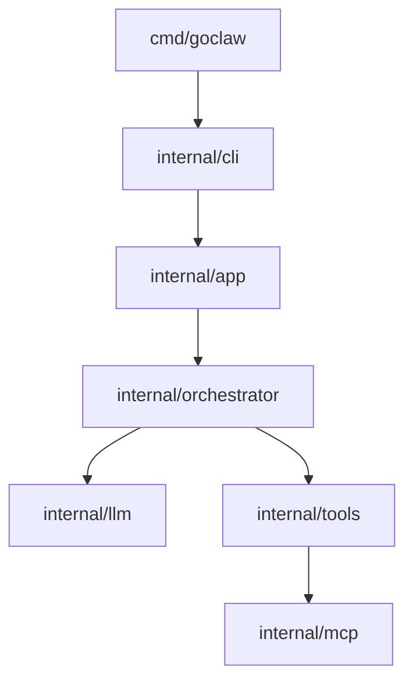

# Architecture hub (monorepo)

This repository ships **[goclaw](../goclaw/)** — a Go CLI coding agent (local-first Ollama, optional Anthropic). **Packages, tools, env vars, decisions D1–D22, and conventions** are in **[goclaw/CLAUDE.md](../goclaw/CLAUDE.md)**. **Where every doc file lives and in what order to read them** is in **[docs-map.md](./docs-map.md)** (do not duplicate that index here).

## Product shape

GoClaw is a **terminal coding agent** (chat loop, tools, permissions, optional MCP, memory, hooks). Defaults and flags: **[usage.md](./goclaw/usage.md)**. Full doc inventory: **[docs-map.md](./docs-map.md)**.

## High-level diagram

**Docs ↔ code layers:** `cmd/goclaw/main.go` wires **`cli.NewRootCmd`** (Cobra in `internal/cli`) into `internal/app` (`RunChat`, `RunPrompt`, `RunListSessions`, `RunDoctor`). When you change a subsystem, see **[reference/code-adjustment-map.md](./reference/code-adjustment-map.md)** for which Markdown files to read and which packages to edit (and [`docs-map.md`](./docs-map.md) for the full file index).

## Changelog

Merged into **[Doc maintenance changelog](./docs-map.md#doc-maintenance-changelog)** in `docs-map.md`.
