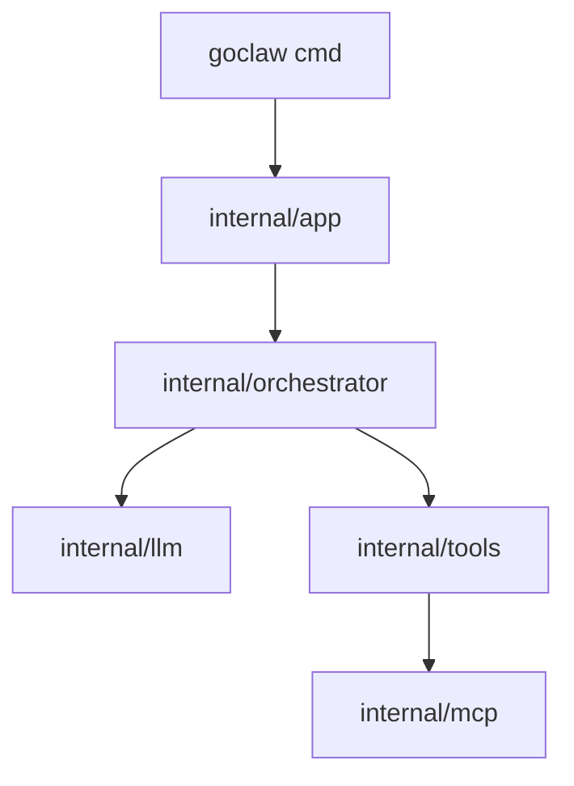

# Architecture hub (monorepo)

This repository ships **[goclaw](../goclaw/)** — a Go CLI coding agent (local-first Ollama, optional Anthropic). **Packages, tools, env vars, decisions D0–D22, and conventions** are in **[goclaw/CLAUDE.md](../goclaw/CLAUDE.md)**. **Where every doc file lives and in what order to read them** is in **[docs-map.md](./docs-map.md)** (do not duplicate that index here).

## Product shape

GoClaw is a **terminal agent**: chat loop, dedicated file/search/web tools, permissions, optional MCP servers, memory, hooks, and a **coordinator** multi-agent profile. On an **interactive TTY**, the default UI is the **Bubble Tea** fullscreen chat. Use **`--readline`** or **`GOCLAW_USE_TUI=0`** for a line-at-a-time REPL.

## Historical draft (Spanish)

The previous long-form specification (sections §1–§8, design exercises, markdown inventory) is preserved as **[architecture-legacy-es.md](./archive/architecture-legacy-es.md)** (links inside use `../` to sibling specs). Sibling docs that cite **§** anchors still point there. **[archive/README.md](./archive/README.md)** lists specs with paths from the archive folder.

## High-level diagram

**Docs ↔ code layers:** when you change a subsystem, see **[reference/code-adjustment-map.md](./reference/code-adjustment-map.md)** for which Markdown files to read and which packages to edit (and [`docs-map.md`](./docs-map.md) for the full file index).

## Changelog

| Date | Change |
|------|--------|
| 2026-04-10 | Replaced with English hub; prior content moved to [architecture-legacy-es.md](./archive/architecture-legacy-es.md). |
| 2026-04-10 | Removed duplicate “Where to read” table; single index is [docs-map.md](./docs-map.md). |
| 2026-04-10 | Link to [code-adjustment-map.md](./reference/code-adjustment-map.md) for docs-to-package adjustment routes. |
