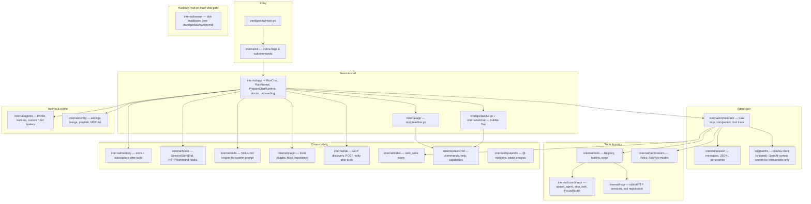
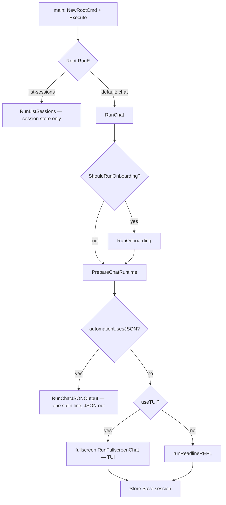
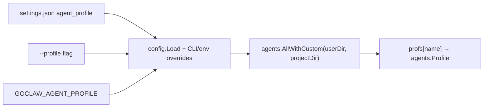
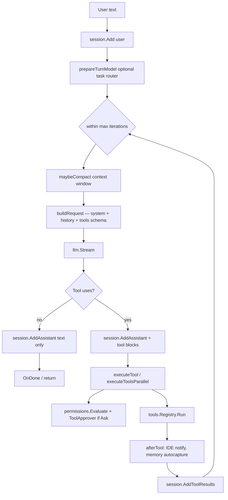
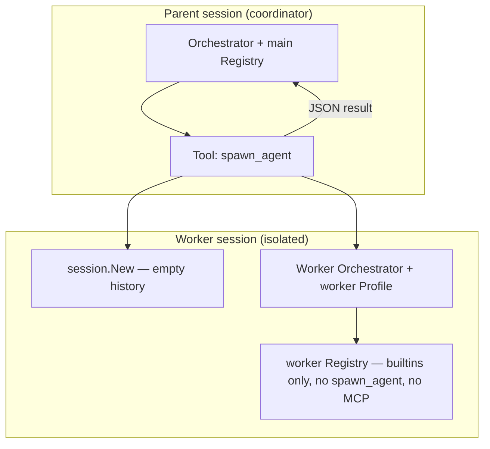
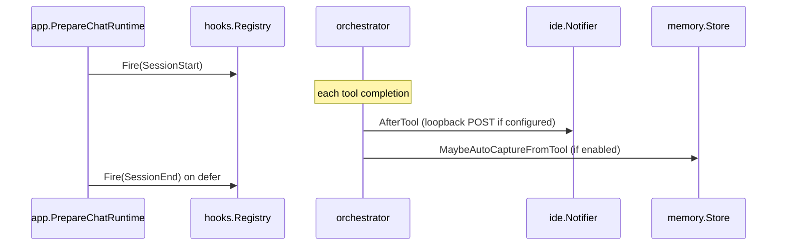

# Architecture hub (monorepo)

This repository ships **[goclaw](../goclaw/)** — a Go CLI coding agent (**local-first Ollama only** for the shipped binary; legacy cloud providers are rejected — see [usage.md — Legacy providers](./goclaw/usage.md#legacy-providers-anthropic-openai_compatible)). **Packages, tools, env vars, decisions D1–D22, and conventions** are in **[goclaw/CLAUDE.md](../goclaw/CLAUDE.md)**. **Where every doc file lives and in what order to read them** is in **[docs-map.md](./docs-map.md)** (do not duplicate that index here).

## Product shape

GoClaw is a **terminal coding agent**: one **user turn** runs an **orchestrator loop** (LLM stream → optional tool calls → results back into the session → repeat). The UI is either a **Bubble Tea TUI** or a **readline REPL**; **`goclaw prompt`** and **stdin JSON mode** skip the interactive shell but reuse the same runtime. Defaults and flags: **[usage.md](./goclaw/usage.md)**.

---

## 1. Code map (packages)

`cmd/goclaw` stays thin: it builds the Cobra tree and delegates to `internal/app`. Almost all behavior lives under `internal/`.

**Docs ↔ code layers:** when you change a subsystem, see **[reference/code-adjustment-map.md](./reference/code-adjustment-map.md)** and **[docs-map.md](./docs-map.md)**.

---

## 2. Boot flow: from `main` to a running chat

- **Onboarding** runs once when appropriate (TTY, non-mock, fresh config); see `internal/app/onboarding.go`.
- **`PrepareChatRuntime`** is the single place that loads **config**, resolves **profile**, opens **LLM client**, **session**, **tools + MCP**, **hooks**, **memory**, and builds **`OrchOpts`** (`internal/app/chat_wiring.go`).

---

## 3. `ChatRuntime`: what one interactive run holds

After `PrepareChatRuntime`, the REPL/TUI receives a `ChatRuntime` value (same structure backs **`goclaw prompt`** and JSON automation):

| Field / concern | Role |
|-----------------|------|
| `Cfg`, `Workdir` | Merged settings + cwd as workspace root |
| `Client` | `llm.Client` — **Ollama** at runtime; `openai_compat` exists for **unit tests** (`testutil/mockopenai`), not user settings |
| `Sess`, `Store` | In-memory transcript + disk JSONL under `sessions/` |
| `Reg` | Main **tool registry** (builtins + `spawn_agent` + `stop_task` + MCP tools) |
| `MemStore`, `Policy`, `HookReg` | Memory filesystem store, permission policy, hook registry |
| `Profile`, `Profs` | Active **`agents.Profile`** and full map (built-in + custom) |
| `McpSessions` | Open MCP connections (closed on defer in `RunChat` / `RunPrompt`) |
| `OrchOpts` | `orchestrator.Option` slice: memory, workdir, project context, skills snippet, todo store, after-tool (IDE + autocapture), optional token counter |

The **orchestrator** is constructed per turn (or owned by the TUI model) as `orchestrator.New(cfg, client, sess, reg, policy, hookReg, profile, orchOpts...)`.

---

## 4. Profile resolution (who the “agent” is)

- **Built-in profiles** live in `internal/agents/profile.go` (`general-purpose`, `explore`, `plan`, `verification`, `code-review`, `guide`, `statusline`, **`coordinator`**).
- **Custom profiles** are `*.md` under `~/.goclaw/agents/` and `<project>/.goclaw/agents/` with YAML frontmatter (`internal/agents/loader.go`). The merged map is passed to **`SpawnAgentTool`**, so **`spawn_agent`** can target **custom** profile names when they appear in that map (built-in workers still use the **worker** tool registry: builtins only, shared memory/skills/project context).
- Each **`Profile`** supplies: optional **model override**, **tool allowlist** (nil = all registered tools), **read-only** flag, and **system prompt** fragment merged into the orchestrator’s system message.

---

## 5. Orchestrator: one user turn (the agent loop)

The orchestrator implements: **user message → (loop)** stream LLM → if model returns tool uses, execute tools (with permissions, optional approval) → append tool results → stream again — until the model returns **text only** or limits hit (`maxIterations` / `maxToolCalls`).

- **Parallel tools** run only when **all** are auto-approved and the batch does not include **`spawn_agent`** (`orchestrator.go`).
- **Compaction** may trim/summarize history when context pressure is detected (`internal/orchestrator/compaction.go`).

---

## 6. Coordinator mode: `spawn_agent` and worker orchestrators

When the active profile is **`coordinator`** (or any profile that includes the tool), the model calls **`spawn_agent`** with a **worker profile name** and a **task string**. The tool implementation (`internal/coordinator/spawn_agent.go`) creates a **new** `session.Session`, builds a **worker** `orchestrator.Orchestrator` with a **separate tool registry** that has **builtins only** (no `spawn_agent`) to prevent infinite nesting, runs **one** `Run` / streaming turn for the sub-task, and returns **`WorkerNotification`** JSON (task id, status, summary, full result).

- **`stop_task`** uses the worker **task id** to cancel a long-running worker (`coordinator.NewStopTask()`).
- **Readline** can show a **focused worker** in the prompt via `coordinator.FocusRouter` (`repl_prompt`).

**Swarm** (`internal/swarm`) is a **separate** minimal disk “mailbox” hub for multi-agent experiments; it is **not** the same code path as `spawn_agent`. See **[goclaw/swarm.md](./goclaw/swarm.md)**.

---

## 7. Tool registration order (main registry)

When tools are enabled (`PrepareChatRuntime`):

1. **`registerBuiltInTools`** on the **main** registry: read/glob/grep/bash, optional script, write/edit/patch, web_fetch, web_search, `todo_write`.
2. **`coordinator.New(...).WithProfiles(...)...`** → **`spawn_agent`** registered on the **main** registry only.
3. **`coordinator.NewStopTask()`** → **`stop_task`**.
4. For each configured MCP server: dial → **`mcp.RegisterSessionTools`** → dynamic tool names on the same registry.
5. Optional **IDE MCP** URL merged into config when `IDEBridgeMCP` discovers a local endpoint (`internal/ide` + `chat_wiring.go`).

Slash commands (`internal/slashcmd`) manipulate session, theme, agents, **doctor** hints, etc.; they are handled in the **UI/REPL layer** before plain text is sent to the orchestrator.

---

## 8. Side channels (hooks, memory, IDE)

---

## 9. Where to read next

| Topic | Primary code | Doc |
|--------|----------------|-----|
| Slash commands & TUI help | `internal/slashcmd`, `internal/ui/chat` | [usage.md](./goclaw/usage.md), [prefix-input-modes.md](./goclaw/prefix-input-modes.md) |
| MCP servers | `internal/mcp`, `internal/config` | [reference/mcp.md](./reference/mcp.md) |
| Permissions / bash | `internal/permissions`, `internal/tools` | [reference/bash-security.md](./reference/bash-security.md) |
| Custom agents | `internal/agents` | [reference/custom-agents.md](./reference/custom-agents.md) |
| IDE bridge | `internal/ide` | [ide-editor-setup.md](./goclaw/ide-editor-setup.md) (golden path), [reference/ide-bridge.md](./reference/ide-bridge.md) (contract) |

## Changelog

Merged into **[Doc maintenance changelog](./docs-map.md#doc-maintenance-changelog)** in `docs-map.md`. Major updates to this file should be noted there.
