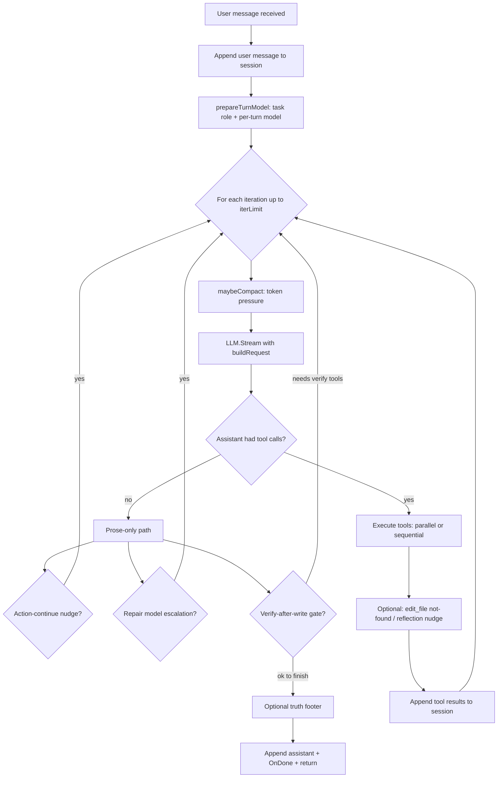

# GoClaw agent runtime (orchestrator)

This document describes the **actual** control flow for one **user turn** (one user message through the REPL, JSON stdin, or TUI submit). It maps runtime injection points so contributors can reason about the loop without reading every branch first.

## One user turn: high-level state machine

Notes:

- **Iteration budget** (`max_orchestrator_iterations`, profile `max_turns`, task-role adaptive cap, TUI chat-mode cap) is computed once per turn; each LLM request counts as one iteration.
- **Tool call budget** counts individual tool executions across the turn.
- **Compaction** may run at the start of an iteration before streaming (`maybeCompact`).

## Main implementation

| Concern | Package / symbol |
|--------|-------------------|
| Turn driver | [`goclaw/internal/orchestrator/orchestrator.go`](../../goclaw/internal/orchestrator/orchestrator.go) `runUserTurn` |
| Request assembly | [`request.go`](../../goclaw/internal/orchestrator/request.go) `buildRequest` |
| Tool dispatch | [`tool_exec.go`](../../goclaw/internal/orchestrator/tool_exec.go) `executeTool` / `executeToolsParallel` |
| Intent nudges | [`action_intent.go`](../../goclaw/internal/orchestrator/action_intent.go) |
| Per-turn state | [`user_turn_context.go`](../../goclaw/internal/orchestrator/user_turn_context.go) `userTurnState` |
| Tool metadata | [`internal/toolpolicy`](../../goclaw/internal/toolpolicy/) |
| Verify gate (opt-in) | [`verify_gate.go`](../../goclaw/internal/orchestrator/verify_gate.go) |

## Prompt and injection map (`buildRequest`)

Applied in order (conceptually; see `buildRequest` for exact concatenation):

1. **Embedded base system prompt** — [`base_system_prompt.md`](../../goclaw/internal/orchestrator/base_system_prompt.md) (identity, tool rules, workflow).
2. **Profile `SystemPrompt`** — from built-in or custom agent.
3. **Workspace / launch directory / path rules** — when `workdir` is set.
4. **Session scratch** — when scratch dir is enabled.
5. **Project context** — `WithProjectContext` snippet.
6. **Skills snippet** — discovered `SKILL.md` content.
7. **Memory blocks** — user + project memory relevance (uses per-turn user message text).
8. **Session todos** — `todo_write` snapshot for prompt.
9. **Task exploration hint** — from classified `task_role` when routing is on.
10. **Reply language hint** — from `turnInputLang` / settings / session heuristic.
11. **TUI interact mode block** — fullscreen mode hint (`chat` / `code` / `agent`).
12. **Qwen-family suffix** — when model id matches Qwen naming.
13. **Budget reminder** — XML-like block when past half the iteration budget; body softens when writes are expected but missing.
14. **Plan profile override** — when active profile is `plan`, appends workflow that overrides conflicting global rules.

## Synthetic user lines injected during a turn (not from the human)

| Trigger | Constant / source | When |
|--------|---------------------|------|
| Action-continue (prose after read-only or no tools on code tasks) | `actionContinueNudgeMessage`, `actionFirstTurnNoToolsNudgeMessage` | `pickActionContinueNudge` in `action_intent.go` |
| Repair escalation | `actionRepairModelEscalationMessage` | After nudges exhausted + `action_repair_escalation` |
| Verify-after-write (opt-in) | `verifyAfterWriteNudgeMessage` | After workspace write without `bash` / `script` / `run_tests` success |
| `edit_file` old_string not found | `editFileNotFoundNudgeMessage` | After tool batch with matching error result |
| Reflection (read-only churn) | `reflectionNudgeMessage` | After N read-only rounds + `enable_reflection_nudge` |

## Coordinator / multi-agent

- **Hub mode** uses the `coordinator` profile and `spawn_agent`; the parent orchestrator loop is unchanged.
- **Parallel tool batches** skip mixing `spawn_agent` with other tools (GPU / duplicate worker avoidance).

## Plan execution (slash)

- **`/apply-plan`** / **`/plan run`**: switch profile, build a **handoff user message** (see [`planfile.HandoffUserMessageWithOptions`](../../goclaw/internal/planfile/planfile.go)), then submit to the model.
- **`--steps`** (multi-submit): when parsed steps exist, the TUI queues **one user message per step** after the first so each step runs in a separate orchestrator turn (bounded by settings).

## Swarm (peer disk hub)

**Triage:** There is no `internal/swarm` Go package in this repository checkout; peer swarm docs (for example [`swarm.md`](swarm.md)) describe a design that is **not wired** into `cmd/goclaw`. No deletion was required for this task — treat as documentation-only until a consumer exists.

## Optional settings (agent loop)

| Key | Effect |
|-----|--------|
| `agent_verify_after_write` | After successful `write_file` / `edit_file` / `patch` on coding-intent turns, inject short nudges until `bash`, `script`, or `run_tests` succeeds (bounded nudges). |
| `parallel_tool_batch_max` | When `provider` is `ollama`, caps how many tools may run in one parallel batch (default **3** when unset; clamped to **16**). |

## Related docs

- [usage.md](usage.md) — REPL commands and profiles.
- [coordinator.md](coordinator.md) — hub-and-spoke behavior.
