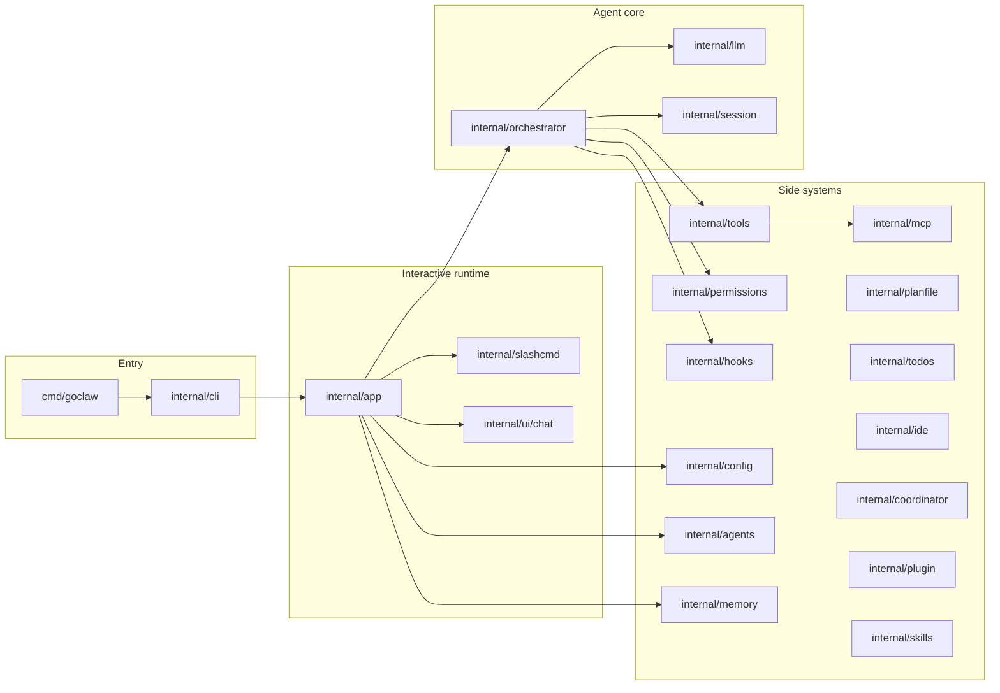

# Documentation (`docs/`) to code layers and adjustment routes

This reference maps **monorepo documentation** to **goclaw Go packages**. Use it when you need to change behavior in a layer: which docs to read first, which code to touch, and which user or contract docs to refresh afterward.

**Implementation source of truth:** [`goclaw/CLAUDE.md`](../../goclaw/CLAUDE.md) (packages, D1–D22, conventions, roadmap). **Master doc index:** [`docs/docs-map.md`](../docs-map.md).

**Maintenance (Diátaxis):** Prefer linking to CLAUDE.md instead of duplicating long tables. After behavior changes, update [`docs/goclaw/usage.md`](../goclaw/usage.md) and [`docs/goclaw/changelog.md`](../goclaw/changelog.md) when user-visible; update the relevant [`docs/reference/`](./) file when a stable contract changes; add or rename top-level docs in [`docs/docs-map.md`](../docs-map.md).

---

## Overview of `docs/`

| Area | Role |
|------|------|
| [`docs/docs-map.md`](../docs-map.md) | Master index: reading order, implementation status, file index |
| [`docs/architecture.md`](../architecture.md) | Short English hub + diagram; links to CLAUDE.md and docs-map |
| [`docs/goclaw/`](../goclaw/) | Operators, product topics (usage, roadmap, coordinator, security, …) |
| [`docs/reference/`](./) | Cross-cutting contracts (tools, hooks, MCP, profiles, retry, IDE, …) |

**Cursor rules (workflow):** [`.cursor/rules/`](../../.cursor/rules/) — e.g. [`architecture.mdc`](../../.cursor/rules/architecture.mdc), [`workflow.mdc`](../../.cursor/rules/workflow.mdc).

---

## Layer diagram

---

## Adjustment routes by layer

### 1. Entry and CLI (`cmd/goclaw`, `internal/cli`)

| Primary doc | Secondary | Code |
|-------------|-----------|------|
| [`goclaw/CLAUDE.md`](../../goclaw/CLAUDE.md) (packages, env vars, flags) | [`docs/goclaw/usage.md`](../goclaw/usage.md) | `cmd/goclaw/main.go`, `tui.go`, `version.go`; `internal/cli/root.go` |
| [`.cursor/rules/architecture.mdc`](../../.cursor/rules/architecture.mdc) | — | Injected `RunChat` / tests without TUI |

**Adjustment:** New flags → Cobra in `internal/cli` + document in `usage.md` and env table in `CLAUDE.md`. Do not add `*_test.go` under `cmd/` (use `internal/cli` / `internal/app`).

---

### 2. App / REPL / TUI (`internal/app`, `internal/slashcmd`, `internal/ui/chat`)

| Primary doc | Secondary | Code |
|-------------|-----------|------|
| `CLAUDE.md` | [`usage.md`](../goclaw/usage.md), [`manual-tui-checklist.md`](../goclaw/manual-tui-checklist.md) | `run.go`, `chat_wiring.go`, `json_output_run.go`, `banner.go`, `onboarding.go`, `onboarding_tui.go`, `telegram_onboard.go`; `replhistory/`; `slashcmd/`; `ui/chat/` |

**Adjustment:** Chat runtime and tool/MCP registration → **`internal/app/chat_wiring.go`**. First-run wizard → `onboarding_tui.go` / `onboarding.go`. Slash commands → `internal/slashcmd`. TUI: async via `tea.Cmd` only; no raw goroutines inside Bubble Tea `Update()` (see architecture rule). Long slash output in the fullscreen chat uses **`slashcmd.UIHints`** (`TUIDocOverlay`, `TUIDocTitle`) plus a **markdown document overlay** in `internal/ui/chat` (`docOverlay*` + `Theme.RenderMarkdown`), not a second Bubble Tea program inside `slashcmd`.

---

### 3. Orchestrator and system prompt (`internal/orchestrator`)

| Primary doc | Secondary | Code |
|-------------|-----------|------|
| `CLAUDE.md` (loop, tool contract, compaction) | [`tool-contract.md`](./tool-contract.md), [`context-compaction.md`](./context-compaction.md) | `orchestrator.go`, `request.go`, `task_model.go`, `task_model_llm.go`, `tool_exec.go`, `compaction.go`, `base_system_prompt.md` |

**Adjustment:** Iteration/tool budgets, profile filtering, model-facing copy → `request.go` / `orchestrator.go`. User-language runtime hint → `user_language_hint.go` (called from `buildRequest`). Execution, permissions, hooks → `tool_exec.go`. Compaction → `compaction.go` + heuristic described in `CLAUDE.md`.

---

### 4. LLM providers and retries (`internal/llm`)

| Primary doc | Secondary | Code |
|-------------|-----------|------|
| `CLAUDE.md` (D1, D22, wire) | [`retry-logic.md`](./retry-logic.md), [`local-models.md`](./local-models.md) | `client.go`, `ollama*.go`, `openai_compat*.go`, `retry.go`, `message.go` |

**Shipped runtime:** only **`OllamaClient`** is wired from `PrepareChatRuntime`. **`openai_compat*.go`** is for **unit tests and `testutil/mockopenai`** — not a user-configurable `provider` in settings.

**Adjustment:** HTTP retries → extend [`internal/llm/retry.go`](../../goclaw/internal/llm/retry.go) only; avoid ad-hoc `http.Client.Do` in clients.

---

### 5. Session and history (`internal/session`)

| Primary doc | Secondary | Code |
|-------------|-----------|------|
| `CLAUDE.md` (JSONL, resume) | [`usage.md`](../goclaw/usage.md) | `internal/session/` |

**Adjustment:** Persistence or message format → `session/` + `usage.md` if UX changes (`--session`, listing).

---

### 6. Built-in tools and limits (`internal/tools`)

| Primary doc | Secondary | Code |
|-------------|-----------|------|
| `CLAUDE.md` (tool table, D4 bash, SSRF) | [`tool-contract.md`](./tool-contract.md), [`bash-security.md`](./bash-security.md) | `registry.go`, `limits.go`, per-tool files, `workspace_paths.go`, `ssrf.go`, `*_test.go` |

**Adjustment:** New tool → `Tool` in `registry.go`, implementation + tests, register in **`chat_wiring.go`**, caps in `limits.go`, risk in `internal/permissions/risk.go` if needed; keep [`tool-contract.md`](./tool-contract.md) aligned.

---

### 7. Permissions and YOLO (`internal/permissions`)

| Primary doc | Secondary | Code |
|-------------|-----------|------|
| `CLAUDE.md` (D5, D17) | [`yolo-classifier.md`](./yolo-classifier.md) | `permissions.go`, `risk.go` |

**Adjustment:** ask/allow/deny and `yolo_threshold` → `risk.go` + config loader; if the risk model changes materially, update the reference doc to match (rule-based vs a separate LLM classifier).

---

### 8. Configuration (`internal/config`)

| Primary doc | Secondary | Code |
|-------------|-----------|------|
| `CLAUDE.md` (paths, merge order, keys) | [`usage.md`](../goclaw/usage.md), [`ollama-stack.md`](../goclaw/ollama-stack.md), [`model-routing.md`](../goclaw/model-routing.md), [`i18n.md`](../goclaw/i18n.md) | `config.go`, `loader.go` (`compaction_model`, `task_model_router`, `task_models`, `preferred_response_language`, related env vars) |

**Adjustment:** New settings keys → `loader.go` + `Default()` + `usage.md` / `CLAUDE.md`. Config paths (`~/.goclaw`, `.goclaw`) are D7 — change only with explicit consensus and doc updates.

---

### 9. Hooks (`internal/hooks`)

| Primary doc | Secondary | Code |
|-------------|-----------|------|
| `CLAUDE.md` (D18) | [`hooks.md`](./hooks.md) | `internal/hooks/` |

**Adjustment:** Events, `external_hooks`, `.goclaw/hooks.json` → implementation + [`hooks.md`](./hooks.md) if the contract changes.

---

### 10. MCP (`internal/mcp` + wiring in `chat_wiring.go`)

| Primary doc | Secondary | Code |
|-------------|-----------|------|
| `CLAUDE.md` (D6, MCP phases) | [`mcp.md`](./mcp.md), [`docs/goclaw/mcp-remote.md`](../goclaw/mcp-remote.md) | `internal/mcp/*`, registration in `chat_wiring.go` |

**Adjustment:** Transport, `mcp__id__name` naming, loopback / `mcp_allow_remote_urls` → `mcp/` + threat notes in `mcp-remote.md`.

---

### 11. Agents and profiles (`internal/agents`)

| Primary doc | Secondary | Code |
|-------------|-----------|------|
| `CLAUDE.md` (D19) | [`agent-profiles.md`](./agent-profiles.md), [`custom-agents.md`](./custom-agents.md) | `profile.go`, `loader.go` |

**Adjustment:** Built-in profiles or Markdown agents → `agents/`; profile tables in `agent-profiles.md` / summary in `usage.md`.

---

### 12. Memory (`internal/memory`)

| Primary doc | Secondary | Code |
|-------------|-----------|------|
| `CLAUDE.md` (D13) | [`memory-system.md`](./memory-system.md), [`usage.md`](../goclaw/usage.md) | `internal/memory/` |

**Adjustment:** Auto-capture or memory types → `memory/`; REPL `/memory` in `usage.md`.

---

### 13. Plan file and todos (`internal/planfile`, `internal/todos`)

| Primary doc | Secondary | Code |
|-------------|-----------|------|
| `CLAUDE.md` | [`usage.md`](../goclaw/usage.md) | `planfile/` (`Path`, `PlansDir`, `Init`, `InitMiniPlan`, `ResolvePlanArg`, `EnsurePlanPathUnderWorkspace`, handoff + steps); `todos/`; `/plan`, `/apply-plan` in `slashcmd` |

---

### 14. IDE (`internal/ide`)

| Primary doc | Secondary | Code |
|-------------|-----------|------|
| `CLAUDE.md` (partial IDE) | [`ide-bridge.md`](./ide-bridge.md), [`ide-editor-setup.md`](../goclaw/ide-editor-setup.md) (golden path) | `ide/notify.go`, `ide/discovery.go` |

**Adjustment:** Keep shipped behavior aligned with §6–§7 in [`ide-bridge.md`](./ide-bridge.md) and the operator checklist in [`ide-editor-setup.md`](../goclaw/ide-editor-setup.md).

---

### 14b. Telegram bridge (`internal/telegram`)

| Primary doc | Secondary | Code |
|-------------|-----------|------|
| [`telegram-bridge.md`](../goclaw/telegram-bridge.md) | [`security.md`](../goclaw/security.md) | `telegram/client.go`, `app/telegram_bridge.go`, `app/telegram_user.go`, `app/telegram_onboard.go`, `config` keys + `loader.go` |

---

### 15. Coordinator (`internal/coordinator`)

| Primary doc | Secondary | Code |
|-------------|-----------|------|
| `CLAUDE.md` (D16) | [`docs/goclaw/coordinator.md`](../goclaw/coordinator.md), [`coordinator-mode.md`](./coordinator-mode.md) | `coordinator/`, `spawn_agent` / `stop_task`, wiring in `chat_wiring.go` |

---

### 16. Plugins, skills, and swarm references

| Primary doc | Secondary | Code |
|-------------|-----------|------|
| `CLAUDE.md` + [`docs-map.md`](../docs-map.md) (coverage column) | [`swarm.md`](../goclaw/swarm.md), [`plugins.md`](./plugins.md), [`skills.md`](./skills.md) | `internal/plugin`, `internal/skills` (`swarm.md` is reference-only in this checkout) |

**Adjustment:** If shipped behavior changes, update the **Coverage** column for those rows in [`docs-map.md`](../docs-map.md).

---

### 17. Security copy and onboarding embed

| Primary doc | Secondary | Code |
|-------------|-----------|------|
| [`docs/goclaw/security.md`](../goclaw/security.md) | [`documentation.md`](../goclaw/documentation.md) (sync note) | [`goclaw/internal/app/onboarding_security_full.md`](../../goclaw/internal/app/onboarding_security_full.md) must mirror `security.md` after edits |

**Adjustment:** Edit [`security.md`](../goclaw/security.md) first, then copy the body into `onboarding_security_full.md` (keep the HTML comment at the top of the embed file).

---

### 18. i18n and prefix input modes

| Primary doc | Secondary | Code |
|-------------|-----------|------|
| [`i18n.md`](../goclaw/i18n.md) | [`usage.md`](../goclaw/usage.md), [`CLAUDE.md`](../../goclaw/CLAUDE.md) | Planned `internal/locale`; orchestrator language hints today |
| [`prefix-input-modes.md`](../goclaw/prefix-input-modes.md) | [`usage.md`](../goclaw/usage.md#prefix-input----btw) | [`internal/inputprefix`](../../goclaw/internal/inputprefix), slash + orchestrator wiring |

---

## Post-change checklist

1. Confirm intent against [`goclaw/CLAUDE.md`](../../goclaw/CLAUDE.md) and the matching area in [`docs/docs-map.md`](../docs-map.md).
2. Implement under `goclaw/internal/*` or thin `cmd/`.
3. **User-facing:** [`usage.md`](../goclaw/usage.md) and, if needed, [`changelog.md`](../goclaw/changelog.md).
4. **Stable contracts:** the relevant [`docs/reference/`](./) file.
5. **Recurring workflow/architecture changes:** consider updating [`.cursor/rules/`](../../.cursor/rules/).

---

## Do not use as a direct adjustment source

- **Upstream comparison (OpenClaw)** — [references.md](./references.md) (GitHub link) and [philosophy.md](../goclaw/philosophy.md#lessons-from-wider-agent-stacks); not a map to the goclaw Go tree.

---

## Changelog

Merged into **[Doc maintenance changelog](../docs-map.md#doc-maintenance-changelog)**.
