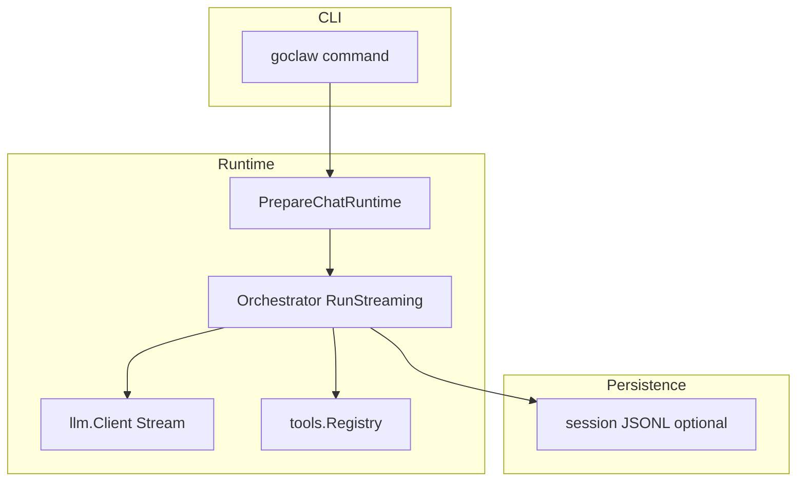
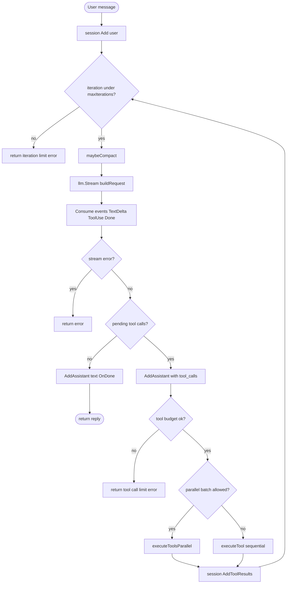
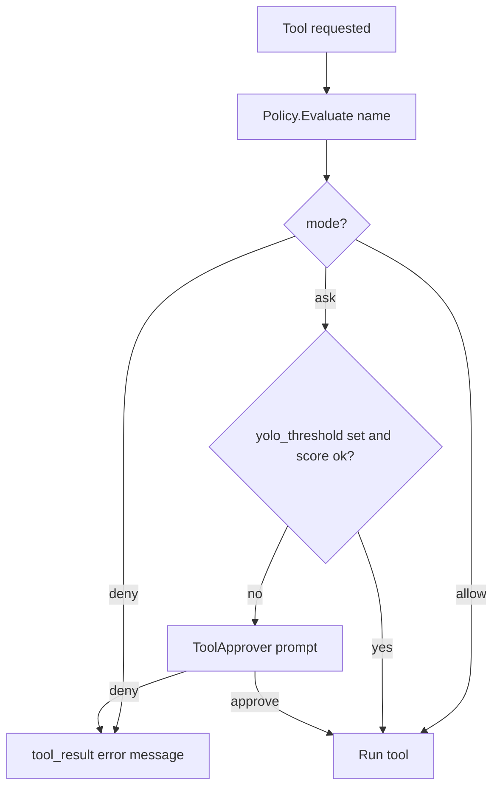
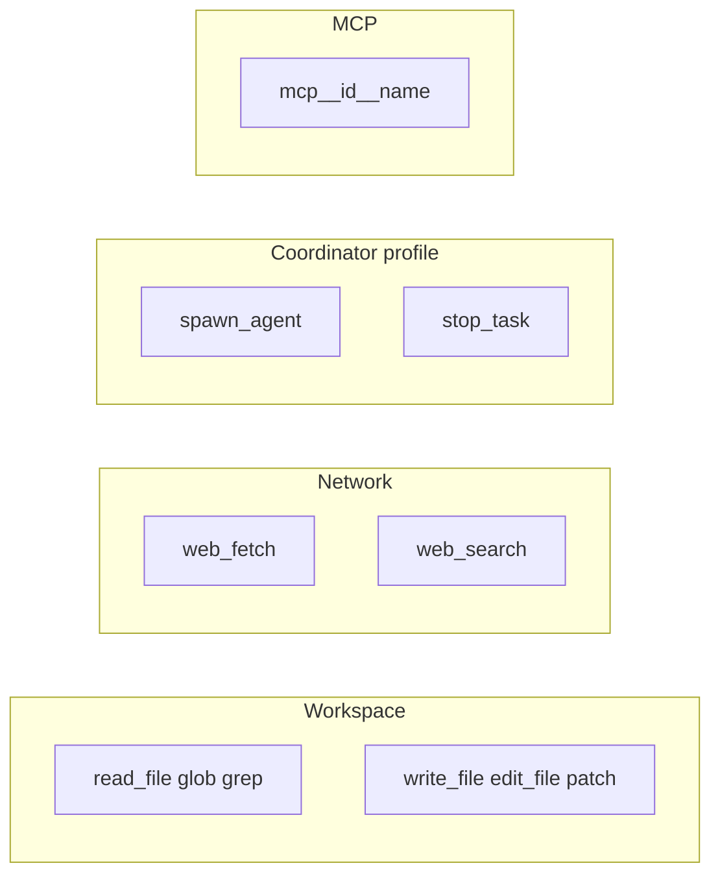
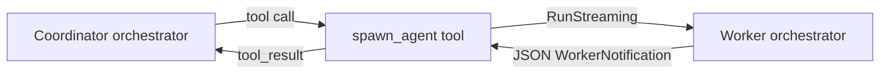
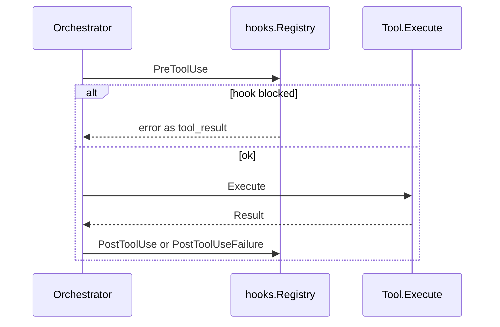

# Tool flows (visual reference)

**Purpose:** Mermaid diagrams and minimal JSON examples for how goclaw turns user input into LLM calls, tool execution, and session updates. For numeric limits, SSRF rules, and the canonical tool table, see [tool-contract.md](./tool-contract.md).

**Implementation anchors:** [`goclaw/internal/orchestrator`](../../goclaw/internal/orchestrator/orchestrator.go), [`goclaw/internal/app/chat_wiring.go`](../../goclaw/internal/app/chat_wiring.go) (`registerBuiltInTools`, coordinator tools), [`goclaw/internal/permissions`](../../goclaw/internal/permissions/).

---

## Scope

| Covered here | Documented elsewhere |
|----------------|----------------------|
| Orchestrator loop, permissions, tool categories, coordinator workers, hooks around tools | [usage.md](../goclaw/usage.md) (CLI, profiles), [CLAUDE.md](../../goclaw/CLAUDE.md) (decisions D1–D22) |
| | Config merge, TUI vs readline, session JSONL store, compaction, memory, plugins, skills — see [docs-map.md](../docs-map.md) and linked topic files |

---

## Application layers (high level)

One turn of chat is wired in [`PrepareChatRuntime`](../../goclaw/internal/app/chat_wiring.go); the orchestrator owns the LLM/tool loop.



---

## Orchestrator loop

Bounded by **32** LLM iterations per user message and **64** tool calls per user message ([tool-contract.md](./tool-contract.md) — Loop Budgets). Implementation: `maxIterations`, `maxToolCalls` in [`orchestrator.go`](../../goclaw/internal/orchestrator/orchestrator.go).



**Parallel batch:** Multiple tools from one assistant message run **concurrently** only if every tool would be auto-approved without prompts (`allToolsAutoApprove`) **and** the batch does **not** include `spawn_agent` (`pendingToolsIncludeSpawnAgent`). Otherwise tools run **one after another**.

---

## Permission decision

Modes come from merged `tool_permissions` in settings (`ask` default). Optional YOLO auto-approval uses `yolo_threshold` and [`RiskScore`](../../goclaw/internal/permissions/risk.go).



---

## Built-in tools by category

Registration is centralized in [`registerBuiltInTools`](../../goclaw/internal/app/chat_wiring.go). The **`script`** tool is registered only when `allow_script` is true in settings.

| Category | Tool names | Notes |
|----------|------------|--------|
| Workspace read | `read_file`, `glob`, `grep` | No network |
| Workspace write | `write_file`, `edit_file`, `patch` | Stripped or blocked on read-only profiles |
| Shell | `bash`, `script` (optional) | `bash`: single simple command, allowlist; `script`: multi-line when enabled |
| Network | `web_fetch`, `web_search` | SSRF policy in [tool-contract.md](./tool-contract.md) |
| Session | `todo_write` | Snapshot in system prompt |
| Coordinator only | `spawn_agent`, `stop_task` | Registered only when profile is `coordinator`; see [coordinator.md](../goclaw/coordinator.md) |
| MCP | `mcp__<server_id>__<remote_tool_name>` | Normalized names; see [mcp.md](./mcp.md) |



---

## Coordinator and worker (`spawn_agent`)

Workers use an isolated [`session.Session`](../../goclaw/internal/session/) and a profile without `spawn_agent` (no nesting). Result JSON shape: `WorkerNotification` in [coordinator.md](../goclaw/coordinator.md).



- **One-shot:** Worker runs until completion or `timeout_sec` (default **120** s, max **600** s).
- **Interactive:** Tool returns immediately with `status: running`; user uses **`/focus`** in the REPL for follow-up messages (see [usage.md](../goclaw/usage.md)).

---

## Hooks around tool execution

Details: [hooks.md](./hooks.md). Order in [`tool_exec.go`](../../goclaw/internal/orchestrator/tool_exec.go):



---

## Minimal JSON examples (inputs to tools)

Strings are illustrative; the model must produce valid JSON per each tool schema.

**Workspace read**

```json
{"path": "README.md", "limit_lines": 80}
```

```json
{"pattern": "**/*.go"}
```

**Workspace write**

```json
{"path": "notes.txt", "content": "hello\n"}
```

```json
{"path": "foo.go", "old_string": "old", "new_string": "new"}
```

**Shell**

```json
{"command": "go test ./...", "cwd": "."}
```

**Network**

```json
{"query": "golang slog structured logging"}
```

```json
{"url": "https://example.com", "max_bytes": 65536}
```

**Session**

```json
{"merge": true, "todos": [{"id": "1", "content": "Fix tests", "status": "in_progress"}]}
```

**Coordinator**

```json
{"profile": "general-purpose", "task": "Add a unit test for package X.", "timeout_sec": 180, "interactive": false}
```

```json
{"task_id": "paste-task-id-from-spawn-result"}
```

(The `stop_task` tool expects the task id from `spawn_agent` output.)

---

## Related topics

| Topic | Doc |
|-------|-----|
| Limits, loop budgets, SSRF | [tool-contract.md](./tool-contract.md) |
| Profiles and slash commands | [usage.md](../goclaw/usage.md), [agent-profiles.md](./agent-profiles.md) |
| Coordinator hub | [coordinator.md](../goclaw/coordinator.md) |
| MCP setup | [mcp.md](./mcp.md) |
| HTTP retries | [retry-logic.md](./retry-logic.md) |
| Architecture index | [architecture.md](../architecture.md) |
